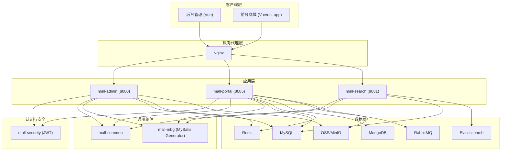
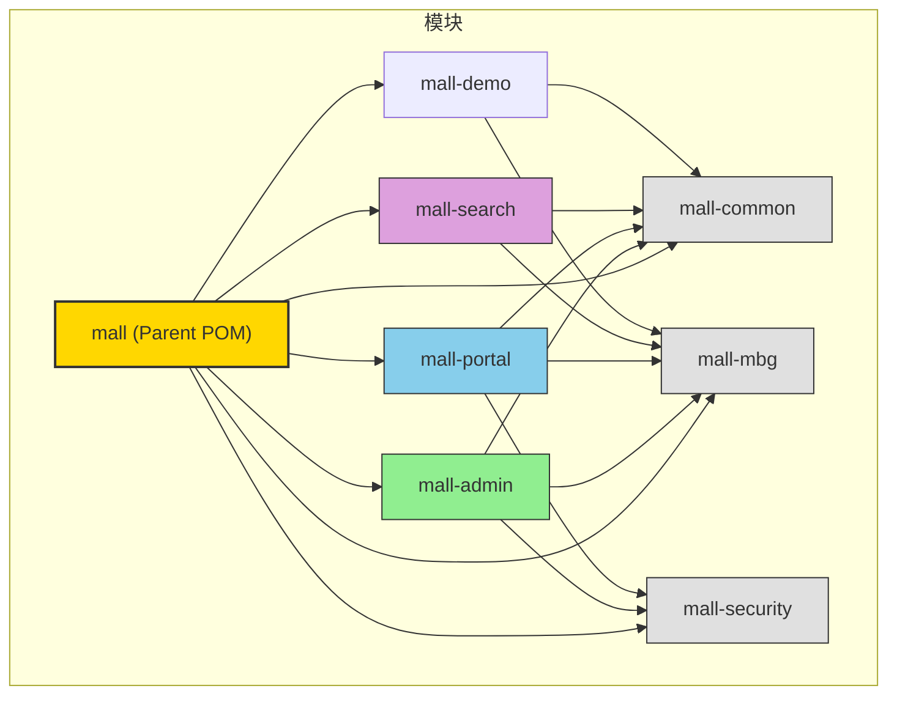
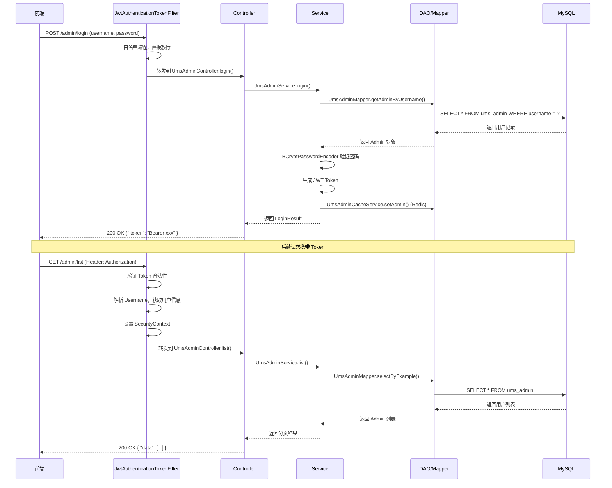
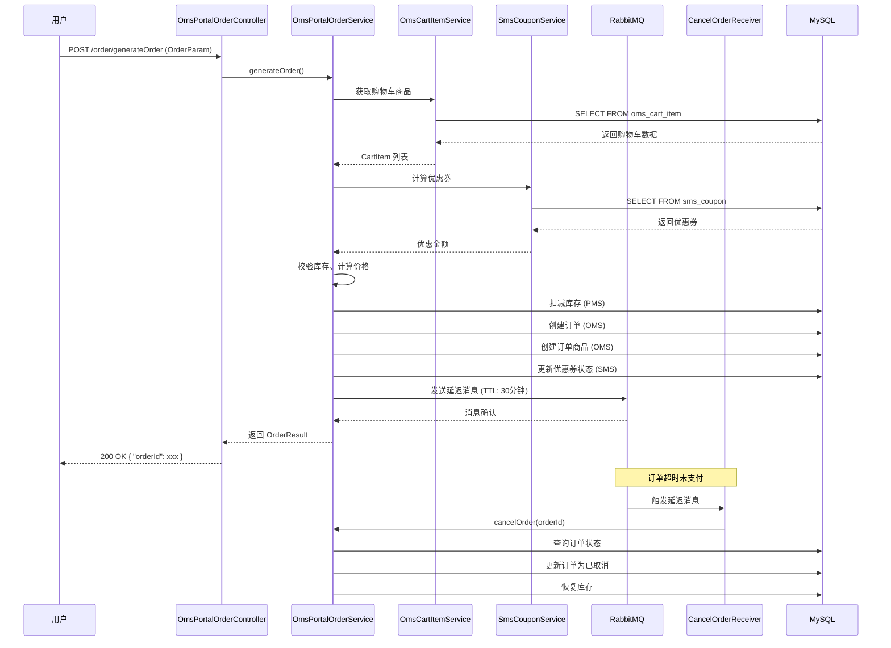
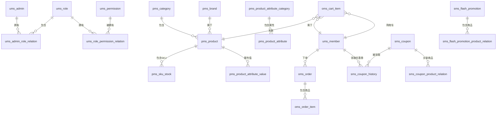
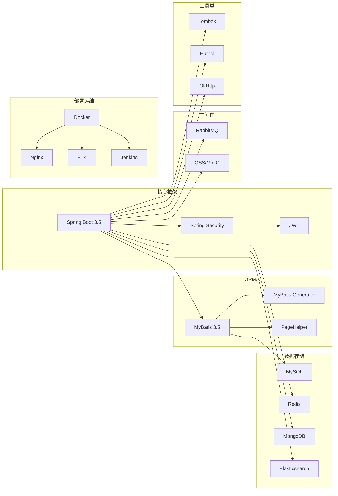

# Mall 电商系统架构与代码地图

> 面向有分布式系统经验但对 Spring Boot/MyBatis/数据库不熟悉的开发者的学习指南

---

## 1. 项目概览与技术栈

### 1.1 项目简介

`mall` 是一个完整的电商系统，包含**后台管理系统**和**前台商城系统**，基于 Spring Boot + MyBatis 实现，支持 Docker 容器化部署。

### 1.2 技术栈总览

| 层级 | 技术 | 说明 |
|------|------|------|
| 语言 | Java 17 | LTS 版本，性能与生态平衡 |
| 框架 | Spring Boot 3.5 | 社区标准 Web 开发框架 |
| 安全 | Spring Security + JWT | 认证与授权 |
| ORM | MyBatis 3.5 + MyBatis Generator | 数据访问层 |
| 连接池 | Druid | 高性能数据库连接池 |
| 缓存 | Redis | 会话、热点数据缓存 |
| 搜索 | Elasticsearch 7.17 | 商品全文检索 |
| 消息队列 | RabbitMQ | 订单超时取消等异步场景 |
| 文档数据库 | MongoDB | 用户收藏、浏览历史 |
| 对象存储 | Aliyun OSS / MinIO | 商品图片存储 |
| 日志 | Logback + Logstash + Kibana (ELK) | 日志收集与可视化 |
| 部署 | Docker + Docker Compose | 容器化部署 |
| API文档 | SpringDoc OpenAPI (Swagger) | 自动生成 API 文档 |

---

## 2. 系统架构图



---

## 3. 模块依赖关系图



| 模块 | 职责 | 端口 | 核心依赖 |
|------|------|------|----------|
| **mall** | Maven Parent，统一版本管理 | - | - |
| **mall-common** | 工具类、API响应、异常处理、Redis基础服务 | - | hutool, lombok |
| **mall-mbg** | MyBatis Generator 生成的 Mapper/Model | - | mybatis-generator |
| **mall-security** | Spring Security + JWT 安全框架封装 | - | spring-security, jjwt |
| **mall-admin** | 后台管理系统 API | 8080 | mall-mbg, mall-security, OSS, MinIO |
| **mall-portal** | 前台商城系统 API | 8085 | mall-mbg, mall-security, RabbitMQ, MongoDB |
| **mall-search** | 商品搜索服务 | 8081 | mall-mbg, elasticsearch |
| **mall-demo** | 框架搭建测试代码 | - | mall-mbg |

---

## 4. 请求处理流程图

### 4.1 后台管理请求流程（带认证）



### 4.2 前台订单创建流程（带消息队列）



---

## 5. 各模块代码地图

### 5.1 mall-common — 通用基础模块

```
mall-common/
├── src/main/java/com/macro/mall/common/
│   ├── api/                    # API 统一响应封装
│   │   ├── CommonResult.java   # 统一响应对象
│   │   ├── CommonPage.java     # 分页响应对象
│   │   ├── IErrorCode.java     # 错误码接口
│   │   └── ResultCode.java     # 错误码枚举
│   ├── config/
│   │   └── BaseRedisConfig.java # Redis 基础配置
│   ├── domain/
│   │   ├── SwaggerProperties.java
│   │   └── WebLog.java
│   ├── exception/              # 全局异常处理
│   │   ├── ApiException.java
│   │   ├── Asserts.java
│   │   └── GlobalExceptionHandler.java
│   ├── log/
│   │   └── WebLogAspect.java   # 请求日志 AOP
│   ├── service/
│   │   └── RedisService.java   # Redis 通用服务
│   └── util/
│       └── RequestUtil.java
└── src/main/resources/
    └── logback-spring.xml       # 日志配置
```

**核心设计模式**：
- **模板方法模式**：`CommonResult` 提供统一响应格式
- **AOP**：`WebLogAspect` 统一日志记录
- **全局异常处理**：`@RestControllerAdvice` + `@ExceptionHandler`

---

### 5.2 mall-mbg — MyBatis 代码生成模块

```
mall-mbg/
├── src/main/java/com/macro/mall/
│   ├── mapper/                 # 自动生成的 Mapper 接口 (~70个)
│   │   ├── CmsHelpMapper.java
│   │   ├── OmsOrderMapper.java
│   │   ├── PmsProductMapper.java
│   │   ├── SmsCouponMapper.java
│   │   └── UmsAdminMapper.java
│   ├── model/                  # 自动生成的 Model 实体类 (~70个)
│   │   ├── CmsHelp.java
│   │   ├── OmsOrder.java
│   │   ├── PmsProduct.java
│   │   ├── SmsCoupon.java
│   │   └── UmsAdmin.java
│   ├── CommentGenerator.java   # 自定义注释生成器
│   └── Generator.java          # 代码生成入口
└── pom.xml
```

**关键概念**：
- **Mapper 接口**：继承 `BaseMapper<T>`，提供 CRUD 方法
- **Model 类**：与数据库表一一对应，使用 Lombok `@Data`
- **Example 类**：用于构建复杂查询条件（如 `UmsAdminExample`）

---

### 5.3 mall-security — 安全认证模块

```
mall-security/
├── src/main/java/com/macro/mall/security/
│   ├── annotation/
│   │   └── CacheException.java
│   ├── aspect/
│   │   └── RedisCacheAspect.java  # Redis 缓存切面
│   ├── component/
│   │   ├── JwtAuthenticationTokenFilter.java  # JWT 过滤器
│   │   ├── DynamicAuthorizationManager.java   # 动态权限管理
│   │   ├── DynamicSecurityMetadataSource.java # 动态权限数据源
│   │   ├── DynamicSecurityService.java        # 动态权限服务接口
│   │   ├── RestAuthenticationEntryPoint.java  # 未认证处理
│   │   └── RestfulAccessDeniedHandler.java    # 无权限处理
│   ├── config/
│   │   ├── CommonSecurityConfig.java
│   │   ├── IgnoreUrlsConfig.java              # 白名单配置
│   │   ├── RedisConfig.java
│   │   └── SecurityConfig.java                # Spring Security 主配置
│   └── util/
│       ├── JwtTokenUtil.java                  # JWT 工具类
│       └── SpringUtil.java                    # Spring 上下文工具
└── pom.xml
```

**安全架构**：
```
请求 → JwtAuthenticationTokenFilter → 认证成功 → SecurityContext → Controller
                                    → 认证失败 → RestAuthenticationEntryPoint → 401
                                    → 权限不足 → RestfulAccessDeniedHandler → 403
```

---

### 5.4 mall-admin — 后台管理系统

```
mall-admin/
├── src/main/java/com/macro/mall/
│   ├── bo/
│   │   └── AdminUserDetails.java              # Spring Security 用户对象
│   ├── config/                                # 配置类
│   │   ├── GlobalCorsConfig.java
│   │   ├── MallSecurityConfig.java            # 后台安全配置
│   │   ├── MyBatisConfig.java
│   │   ├── OssConfig.java                     # OSS 配置
│   │   └── SpringDocConfig.java               # Swagger 配置
│   ├── controller/                            # REST API 控制器 (~25个)
│   │   ├── PmsProductController.java          # 商品管理
│   │   ├── OmsOrderController.java            # 订单管理
│   │   ├── SmsCouponController.java           # 促销管理
│   │   ├── UmsAdminController.java            # 用户管理
│   │   ├── OssController.java                 # 文件上传
│   │   └── ...
│   ├── dao/                                   # 自定义 DAO (~20个)
│   │   ├── PmsProductDao.java                 # 商品自定义查询
│   │   ├── OmsOrderDao.java                   # 订单自定义查询
│   │   └── ...
│   ├── dto/                                   # 请求/响应 DTO (~30个)
│   │   ├── PmsProductParam.java
│   │   ├── OmsOrderQueryParam.java
│   │   └── ...
│   ├── service/                               # 业务服务接口 (~25个)
│   │   └── impl/                              # 服务实现类 (~25个)
│   │       ├── PmsProductServiceImpl.java
│   │       ├── OmsOrderServiceImpl.java
│   │       └── ...
│   ├── validator/
│   │   ├── FlagValidator.java                 # 自定义校验器
│   │   └── FlagValidatorClass.java
│   └── MallAdminApplication.java              # 启动类
└── src/main/resources/
    ├── dao/                                   # MyBatis XML 映射文件 (~20个)
    │   ├── PmsProductDao.xml
    │   ├── OmsOrderDao.xml
    │   └── ...
    ├── application.yml                        # 主配置
    ├── application-dev.yml                    # 开发环境配置
    └── application-prod.yml                   # 生产环境配置
```

**业务模块划分**：

| 前缀 | 模块名称 | 职责 | 核心表 |
|------|----------|------|--------|
| **Pms** | Product Management | 商品管理 | pms_product, pms_brand, pms_category |
| **Oms** | Order Management | 订单管理 | oms_order, oms_order_item |
| **Sms** | Sale Management | 促销管理 | sms_coupon, sms_flash_promotion |
| **Cms** | Content Management | 内容管理 | cms_subject, cms_help |
| **Ums** | User Management | 用户/权限管理 | ums_admin, ums_role, ums_resource |

---

### 5.5 mall-portal — 前台商城系统

```
mall-portal/
├── src/main/java/com/macro/mall/portal/
│   ├── component/                             # 消息队列组件
│   │   ├── CancelOrderReceiver.java           # 订单取消消费者
│   │   ├── CancelOrderSender.java             # 订单取消生产者
│   │   └── OrderTimeOutCancelTask.java        # 订单超时取消定时任务
│   ├── config/
│   │   ├── AlipayClientConfig.java            # 支付宝配置
│   │   ├── AlipayConfig.java
│   │   ├── RabbitMqConfig.java                # RabbitMQ 配置
│   │   ├── SpringTaskConfig.java              # 定时任务配置
│   │   └── MallSecurityConfig.java            # 前台安全配置
│   ├── controller/                            # 前台 API 控制器 (~15个)
│   │   ├── HomeController.java                # 首页
│   │   ├── OmsPortalOrderController.java      # 订单
│   │   ├── OmsCartItemController.java         # 购物车
│   │   ├── PmsPortalProductController.java    # 商品
│   │   ├── UmsMemberController.java           # 会员
│   │   └── AlipayController.java              # 支付宝支付
│   ├── dao/                                   # 前台自定义 DAO
│   │   ├── HomeDao.java
│   │   ├── PortalOrderDao.java
│   │   └── PortalProductDao.java
│   ├── domain/                                # 前台业务模型 (~20个)
│   │   ├── CartProduct.java
│   │   ├── ConfirmOrderResult.java
│   │   ├── HomeContentResult.java
│   │   └── OrderParam.java
│   ├── repository/                            # MongoDB Repository
│   │   ├── MemberBrandAttentionRepository.java
│   │   ├── MemberProductCollectionRepository.java
│   │   └── MemberReadHistoryRepository.java
│   ├── service/                               # 前台服务
│   │   └── impl/
│   │       ├── OmsPortalOrderServiceImpl.java
│   │       └── UmsMemberServiceImpl.java
│   ├── util/
│   │   └── DateUtil.java
│   └── MallPortalApplication.java
└── src/main/resources/
    ├── dao/                                   # MyBatis XML
    └── application.yml
```

**前台核心业务流程**：
```
首页 → 商品搜索 → 商品详情 → 加入购物车 → 结算 → 提交订单 → 支付 → 收货 → 评价
```

---

### 5.6 mall-search — 商品搜索服务

```
mall-search/
├── src/main/java/com/macro/mall/search/
│   ├── config/
│   │   ├── MyBatisConfig.java
│   │   └── SpringDocConfig.java
│   ├── controller/
│   │   └── EsProductController.java           # 搜索 API
│   ├── dao/
│   │   └── EsProductDao.java                  # 从 MySQL 同步数据
│   ├── domain/
│   │   ├── EsProduct.java                     # ES 商品文档
│   │   ├── EsProductAttributeValue.java
│   │   └── EsProductRelatedInfo.java
│   ├── repository/
│   │   └── EsProductRepository.java           # Spring Data Elasticsearch
│   ├── service/
│   │   ├── EsProductService.java
│   │   └── impl/
│   │       └── EsProductServiceImpl.java
│   └── MallSearchApplication.java
└── src/main/resources/
    ├── dao/EsProductDao.xml
    └── application.yml
```

**搜索流程**：
```
MySQL商品数据 → EsProductService.importAll() → Elasticsearch索引
                    ↓
用户搜索请求 → EsProductRepository.search() → 返回搜索结果
```

---

## 6. 数据库领域模型（ER图）

### 6.1 核心业务表关系



### 6.2 表名前缀说明

| 前缀 | 全称 | 模块 | 说明 |
|------|------|------|------|
| **ums** | User Management System | 用户管理 | 用户、角色、权限、会员 |
| **pms** | Product Management System | 商品管理 | 商品、品牌、分类、属性、SKU |
| **oms** | Order Management System | 订单管理 | 订单、订单商品、购物车、退货 |
| **sms** | Sale Management System | 促销管理 | 优惠券、秒杀、活动 |
| **cms** | Content Management System | 内容管理 | 专题、帮助、话题、广告 |

### 6.3 关键表结构速览

**ums_admin（管理员表）**：
| 字段 | 类型 | 说明 |
|------|------|------|
| id | bigint | 主键 |
| username | varchar(64) | 用户名 |
| password | varchar(64) | 密码（BCrypt加密） |
| icon | varchar(500) | 头像 |
| email | varchar(100) | 邮箱 |
| nick_name | varchar(500) | 昵称 |
| note | varchar(500) | 备注 |

**pms_product（商品表）**：
| 字段 | 类型 | 说明 |
|------|------|------|
| id | bigint | 主键 |
| brand_id | bigint | 品牌ID |
| product_category_id | bigint | 分类ID |
| name | varchar(200) | 商品名称 |
| product_sn | varchar(64) | 商品编号 |
| price | decimal | 价格 |
| stock | int | 库存 |
| low_stock | int | 预警库存 |
| publish_status | int | 发布状态 |
| verify_status | int | 审核状态 |

**oms_order（订单表）**：
| 字段 | 类型 | 说明 |
|------|------|------|
| id | bigint | 主键 |
| member_id | bigint | 会员ID |
| order_sn | varchar(64) | 订单编号 |
| total_amount | decimal | 订单总额 |
| pay_amount | decimal | 实付金额 |
| freight_amount | decimal | 运费 |
| status | int | 订单状态 |
| pay_type | int | 支付方式 |
| create_time | datetime | 创建时间 |
| payment_time | datetime | 支付时间 |

---

## 7. 分布式系统 → Spring/MyBatis 概念映射

> 对于有分布式系统经验但不熟悉 Spring Boot/MyBatis 的开发者

| 分布式系统概念 | Spring Boot/MyBatis 对应概念 | 说明 |
|----------------|-----------------------------|------|
| **Service Discovery** | 本项目是单体架构 | 微服务版本见 `mall-swarm` |
| **Load Balancing** | Nginx 反向代理 | 见 `document/docker/nginx.conf` |
| **ORM / ActiveRecord** | **MyBatis XML Mapper** | 手写 SQL，灵活可控 |
| **Repository / DAO** | **Mapper 接口** | 继承 `BaseMapper<T>` |
| **Entity** | **Model 类** | 与数据库表一一对应 |
| **Middleware / Filter** | **Spring Security FilterChain** | JWT 认证、权限校验 |
| **Interceptor** | **Spring AOP** | 日志、缓存、事务 |
| **Message Queue Producer** | **RabbitMQ Sender** | `CancelOrderSender` |
| **Message Queue Consumer** | **RabbitMQ Receiver** | `CancelOrderReceiver` |
| **Cache** | **Redis + RedisService** | 会话、热点数据 |
| **Full-text Search** | **Elasticsearch** | `mall-search` 模块 |
| **NoSQL** | **MongoDB** | 用户收藏、浏览历史 |
| **Object Storage** | **OSS / MinIO** | 商品图片存储 |
| **Configuration Center** | **application.yml / application-dev.yml** | 多环境配置 |
| **Health Check** | **Spring Boot Actuator** | `/actuator/**` |
| **API Gateway** | **Nginx** | 路由转发、静态资源 |
| **Rate Limiting** | **Redis + AOP** | 可基于 `RedisService` 实现 |

### 7.1 Spring Boot 核心概念速查

| 概念 | 说明 | 示例 |
|------|------|------|
| **@SpringBootApplication** | 启动类注解，包含自动配置 | `MallAdminApplication` |
| **@RestController** | REST API 控制器 | `PmsProductController` |
| **@Service** | 业务服务层 | `PmsProductService` |
| **@Autowired** | 依赖注入 | `@Autowired PmsProductService productService` |
| **@Mapper** | MyBatis Mapper 接口 | `UmsAdminMapper` |
| **@Transactional** | 事务注解 | `@Transactional(rollbackFor = Exception.class)` |
| **@Configuration** | 配置类 | `MyBatisConfig` |
| **@Value** | 读取配置 | `@Value("${jwt.secret}")` |
| **@EnableScheduling** | 启用定时任务 | `SpringTaskConfig` |

### 7.2 MyBatis 核心概念速查

| 概念 | 说明 | 示例 |
|------|------|------|
| **Mapper Interface** | DAO 接口，定义 SQL 方法 | `UmsAdminMapper.selectByPrimaryKey()` |
| **Mapper XML** | SQL 映射文件 | `UmsAdminMapper.xml` |
| **ResultMap** | 结果集映射 | `<resultMap id="BaseResultMap" type="UmsAdmin">` |
| **Example** | 条件查询构建器 | `UmsAdminExample.Criteria.andUsernameEqualTo()` |
| **#{...}** | 预编译参数（安全） | `WHERE username = #{username}` |
| **${...}** | 字符串替换（需谨慎） | `ORDER BY ${orderByClause}` |
| **PageHelper** | 物理分页插件 | `PageHelper.startPage(pageNum, pageSize)` |

---

## 8. 推荐学习路径

### 8.1 入门阶段（1-2周）

1. **mall-common** — 理解统一响应、异常处理、Redis 基础
2. **mall-mbg** — 理解 MyBatis Generator、Mapper 接口、Model 类
3. **mall-security** — 理解 JWT 认证流程、Spring Security 配置
4. **mall-admin** — 从 `UmsAdminController` 入手，理解完整 CRUD 流程

### 8.2 进阶阶段（2-3周）

5. **商品管理** — `PmsProductController` → `PmsProductService` → `PmsProductDao`
6. **订单管理** — `OmsOrderController`，理解订单状态流转
7. **促销管理** — `SmsCouponController`，理解优惠券逻辑

### 8.3 高级阶段（2-3周）

8. **mall-portal** — 前台订单创建流程、RabbitMQ 异步处理、支付宝支付
9. **mall-search** — Elasticsearch 索引同步、全文搜索
10. **MongoDB** — 用户收藏、浏览历史的存储

### 8.4 实践建议

| 步骤 | 任务 | 目的 |
|------|------|------|
| 1 | 运行 `mall-admin`，访问 Swagger | 熟悉 API 文档 |
| 2 | 添加一个新的商品分类 | 理解 Controller→Service→DAO 流程 |
| 3 | 修改商品查询接口，添加新条件 | 理解 MyBatis XML 映射 |
| 4 | 实现一个新的促销活动类型 | 理解业务逻辑设计 |
| 5 | 阅读订单超时取消流程 | 理解 RabbitMQ 异步处理 |

---

## 9. 关键配置文件

| 文件 | 路径 | 作用 |
|------|------|------|
| 主配置 | `mall-admin/src/main/resources/application.yml` | JWT、Redis、白名单 |
| 开发环境 | `mall-admin/src/main/resources/application-dev.yml` | 数据库连接、日志级别 |
| 生产环境 | `mall-admin/src/main/resources/application-prod.yml` | 生产环境配置 |
| Docker Compose | `document/docker/docker-compose-app.yml` | 应用部署编排 |
| Nginx | `document/docker/nginx.conf` | 反向代理配置 |
| 数据库脚本 | `document/sql/mall.sql` | 完整建表语句和初始数据 |
| Postman | `document/postman/mall-admin.postman_collection.json` | API 测试用例 |

---

## 10. 核心流程图索引

| 流程图 | 资源路径 |
|--------|----------|
| 系统架构图 | `document/resource/re_mall_system_arch.jpg` |
| 业务架构图 | `document/resource/re_mall_business_arch.jpg` |
| 商品功能图 | `document/resource/mind_product.jpg` |
| 订单功能图 | `document/resource/mind_order.jpg` |
| 促销功能图 | `document/resource/mind_sale.jpg` |
| 用户功能图 | `document/resource/mind_member.jpg` |
| 前台功能图 | `document/resource/mind_portal.jpg` |

---

> **学习提示**：对于有分布式系统经验的你，重点关注：
> 1. **Spring Boot 的自动配置机制**（理解 `@SpringBootApplication`）
> 2. **MyBatis 的 SQL 映射方式**（对比 ORM 框架）
> 3. **Spring Security 的过滤器链**（对比中间件）
> 4. **事务管理**（`@Transactional` 的传播行为）
> 5. **异步处理**（RabbitMQ、定时任务）

---

## 11. 后端技术栈学习优先级清单

### 11.1 技术栈全景图



### 11.2 学习优先级分类

#### 🔴 第一优先级：必须学习（理解代码）

| 技术 | 必要性 | 在项目中的作用 | 学习重点 |
|------|--------|----------------|----------|
| **Spring Boot 3.5** | 核心 | 整个项目的基础框架 | 自动配置、注解驱动、依赖注入、配置文件 |
| **Spring Security** | 核心 | 认证与授权 | 过滤器链、UserDetails、权限表达式 |
| **JWT** | 核心 | 无状态认证 | Token生成/验证、Header传递 |
| **MyBatis 3.5** | 核心 | 数据访问层 | Mapper接口、XML映射、ResultMap、动态SQL |
| **MyBatis Generator** | 核心 | 自动生成代码 | Generator配置、模板自定义 |
| **MySQL** | 核心 | 主数据库 | SQL语法、索引设计、事务隔离、分表分库概念 |
| **Lombok** | 核心 | 简化代码 | `@Data`、`@Slf4j`、`@Builder` |
| **Hutool** | 重要 | 工具类库 | 日期处理、加密、JSON、集合工具 |

#### 🟠 第二优先级：必须学习（运行项目）

| 技术 | 必要性 | 在项目中的作用 | 学习重点 |
|------|--------|----------------|----------|
| **Redis** | 必须 | 缓存、会话、分布式锁 | String/Hash/List/ZSet数据结构、过期策略 |
| **RabbitMQ** | 必须 | 订单超时取消、异步消息 | Exchange/Queue/Binding、延迟队列、消息确认 |
| **PageHelper** | 重要 | 物理分页 | `startPage()`、分页参数传递 |
| **Druid** | 重要 | 数据库连接池 | 连接池配置、监控功能 |
| **SpringDoc** | 重要 | API文档 | Swagger UI使用、注解配置 |

#### 🟡 第三优先级：模块特定（按需学习）

| 技术 | 所属模块 | 在项目中的作用 | 学习重点 |
|------|----------|----------------|----------|
| **Elasticsearch 7.17** | mall-search | 商品全文检索 | 索引创建、Mapping、Query DSL、聚合 |
| **MongoDB** | mall-portal | 用户收藏、浏览历史 | 文档存储、CRUD操作、索引 |
| **OSS / MinIO** | mall-admin | 商品图片存储 | 文件上传/下载、签名URL |
| **Alipay SDK** | mall-portal | 支付宝支付 | 支付流程、签名验证 |
| **OkHttp** | 通用 | HTTP客户端 | 请求构建、拦截器、连接池 |

#### 🟢 第四优先级：部署运维（可延后）

| 技术 | 在项目中的作用 | 学习重点 |
|------|----------------|----------|
| **Docker** | 容器化部署 | Dockerfile、镜像构建 |
| **Docker Compose** | 多容器编排 | docker-compose.yml、网络配置 |
| **Nginx** | 反向代理、负载均衡 | 配置文件、路由规则 |
| **ELK** | 日志收集与分析 | Logstash配置、Kibana可视化 |
| **Jenkins** | 自动化部署 | Pipeline配置 |

### 11.3 各模块技术依赖矩阵

| 模块 | Spring Boot | Spring Security | JWT | MyBatis | MySQL | Redis | RabbitMQ | MongoDB | Elasticsearch | OSS | Docker |
|------|:---:|:---:|:---:|:---:|:---:|:---:|:---:|:---:|:---:|:---:|:---:|
| mall-admin | ✅ | ✅ | ✅ | ✅ | ✅ | ✅ | - | - | - | ✅ | ✅ |
| mall-portal | ✅ | ✅ | ✅ | ✅ | ✅ | ✅ | ✅ | ✅ | - | ✅ | ✅ |
| mall-search | ✅ | - | - | ✅ | ✅ | - | - | - | ✅ | - | ✅ |
| mall-security | ✅ | ✅ | ✅ | - | - | ✅ | - | - | - | - | - |
| mall-common | ✅ | - | - | - | - | ✅ | - | - | - | - | - |
| mall-mbg | - | - | - | ✅ | ✅ | - | - | - | - | - | - |

### 11.4 Spring Cloud 说明

> ⚠️ **重要**：本项目 (`mall`) 是一个**单体架构**，**不包含 Spring Cloud**！
> 
> 如果需要学习 Spring Cloud 微服务架构，请查看项目作者的另一个仓库：
> - **mall-swarm**：基于 Spring Cloud Alibaba 的微服务版本
> - 地址：https://github.com/macrozheng/mall-swarm
> 
> mall-swarm 包含的微服务组件：
> - Nacos（服务发现与配置中心）
> - Sentinel（流量控制与熔断降级）
> - Seata（分布式事务）
> - Feign（声明式HTTP客户端）
> - Gateway（API网关）
> - SkyWalking（链路追踪）

### 11.5 学习路线图

```
第1周：Spring Boot基础 + Lombok + Hutool
    └─ 目标：能独立创建一个简单的Spring Boot项目

第2周：Spring Security + JWT
    └─ 目标：理解认证流程，能实现登录接口

第3周：MyBatis + MySQL
    └─ 目标：能编写CRUD接口，理解XML映射

第4周：Redis + 项目运行
    └─ 目标：运行mall-admin模块，访问Swagger

第5周：RabbitMQ + 订单流程
    └─ 目标：理解异步消息，运行mall-portal模块

第6周：Elasticsearch + 搜索功能
    └─ 目标：运行mall-search模块，实现商品搜索

第7周：MongoDB + OSS + 支付
    └─ 目标：理解非关系型数据库和第三方服务集成

第8周：Docker + 部署
    └─ 目标：容器化部署整个项目
```

### 11.6 快速开始最小环境

如果你只想先运行项目体验，**最低配置**只需安装：

1. **JDK 17** — 运行项目必须
2. **MySQL 5.7+** — 主数据库，执行 `document/sql/mall.sql` 初始化
3. **Redis 7.0+** — 缓存，启动即可，无需特殊配置

启动顺序：
```bash
# 1. 启动 MySQL（确保已导入 mall.sql）
# 2. 启动 Redis
# 3. 启动 mall-admin
cd mall-admin
mvn spring-boot:run
# 4. 访问 http://localhost:8080/swagger-ui.html
```

> **提示**：如果只运行 `mall-admin`，无需安装 RabbitMQ、MongoDB、Elasticsearch。