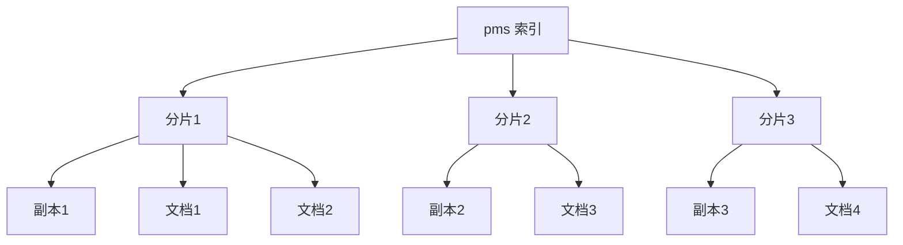
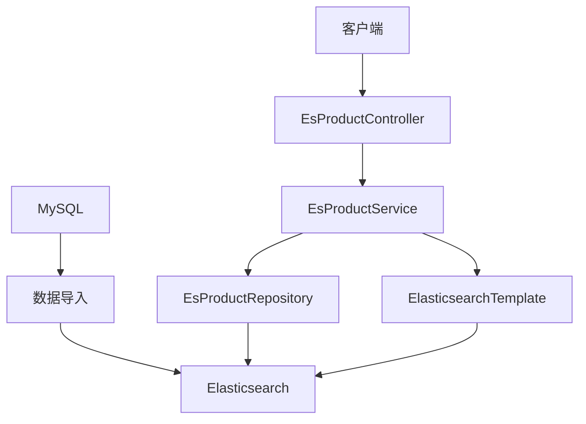
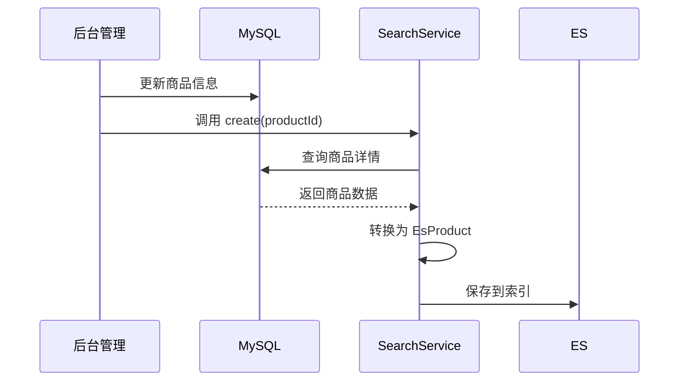

# Elasticsearch 快速学习指南（面试版）

> 目标：一天内掌握 Elasticsearch 核心知识点，应对面试

---

## 1. Elasticsearch 基础

### 1.1 什么是 Elasticsearch？

- **Elasticsearch**（简称 ES）是一个基于 Lucene 的分布式搜索和分析引擎
- **特点**：
  - 全文搜索：支持中文分词（IK分词器）
  - 分布式：自动分片和副本
  - 实时搜索：近实时（NRT）索引
  - 聚合分析：支持复杂统计和聚合

### 1.2 核心概念

| 概念 | 说明 | 类比关系型数据库 |
|------|------|------------------|
| **Index** | 索引，一组文档的集合 | Database（数据库） |
| **Type** | 类型，索引内的文档分类 | Table（表） |
| **Document** | 文档，最小数据单元 | Row（行） |
| **Field** | 字段，文档的属性 | Column（列） |
| **Mapping** | 映射，字段的类型和配置 | Schema（表结构） |
| **Shard** | 分片，数据的物理分区 | - |
| **Replica** | 副本，分片的备份 | - |

---

## 2. 数据结构

### 2.1 索引结构



### 2.2 字段类型

| 类型 | 说明 | 示例 |
|------|------|------|
| **Text** | 文本类型，支持分词 | 商品名称、描述 |
| **Keyword** | 关键词类型，不分词 | 品牌名称、分类名称 |
| **Long/Integer** | 数值类型 | 价格、库存 |
| **Date** | 日期类型 | 创建时间 |
| **Nested** | 嵌套类型 | 商品属性列表 |
| **GeoPoint** | 地理位置类型 | 经纬度 |

---

## 3. 项目中的 Elasticsearch 应用

### 3.1 商品搜索服务架构



### 3.2 文档实体类

```java
// 项目路径: mall-search/src/main/java/com/macro/mall/search/domain/EsProduct.java
@Data
@Document(indexName = "pms")
@Setting(shards = 1, replicas = 0)
public class EsProduct implements Serializable {
    @Id
    private Long id;
    
    @Field(type = FieldType.Keyword)
    private String productSn;
    
    private Long brandId;
    
    @Field(type = FieldType.Keyword)
    private String brandName;
    
    @Field(analyzer = "ik_max_word", type = FieldType.Text)
    private String name;
    
    @Field(analyzer = "ik_max_word", type = FieldType.Text)
    private String subTitle;
    
    @Field(analyzer = "ik_max_word", type = FieldType.Text)
    private String keywords;
    
    private BigDecimal price;
    
    private Integer sale;
    
    @Field(type = FieldType.Nested, fielddata = true)
    private List<EsProductAttributeValue> attrValueList;
}
```

### 3.3 Repository（数据访问）

```java
// 项目路径: mall-search/src/main/java/com/macro/mall/search/repository/EsProductRepository.java
public interface EsProductRepository extends ElasticsearchRepository<EsProduct, Long> {
    
    /**
     * 根据名称、副标题、关键词搜索
     */
    Page<EsProduct> findByNameOrSubTitleOrKeywords(
        String name, 
        String subTitle, 
        String keywords, 
        Pageable pageable
    );
}
```

### 3.4 Service（业务逻辑）

```java
// 项目路径: mall-search/src/main/java/com/macro/mall/search/service/impl/EsProductServiceImpl.java
@Service
public class EsProductServiceImpl implements EsProductService {
    
    @Autowired
    private EsProductDao productDao;
    
    @Autowired
    private EsProductRepository productRepository;
    
    @Autowired
    private ElasticsearchTemplate elasticsearchTemplate;
    
    /**
     * 从数据库导入所有商品到ES
     */
    @Override
    public int importAll() {
        List<EsProduct> esProductList = productDao.getAllEsProductList(null);
        Iterable<EsProduct> esProductIterable = productRepository.saveAll(esProductList);
        int result = 0;
        Iterator<EsProduct> iterator = esProductIterable.iterator();
        while (iterator.hasNext()) {
            result++;
            iterator.next();
        }
        return result;
    }
    
    /**
     * 综合搜索（支持过滤、排序）
     */
    @Override
    public Page<EsProduct> search(String keyword, Long brandId, Long productCategoryId, 
                                   Integer pageNum, Integer pageSize, Integer sort) {
        Pageable pageable = PageRequest.of(pageNum, pageSize);
        NativeQueryBuilder nativeQueryBuilder = new NativeQueryBuilder();
        
        // 过滤条件
        if (brandId != null || productCategoryId != null) {
            Query boolQuery = QueryBuilders.bool(builder -> {
                if (brandId != null) {
                    builder.must(QueryBuilders.term(b -> b.field("brandId").value(brandId)));
                }
                if (productCategoryId != null) {
                    builder.must(QueryBuilders.term(b -> b.field("productCategoryId").value(productCategoryId)));
                }
                return builder;
            });
            nativeQueryBuilder.withFilter(boolQuery);
        }
        
        // 搜索条件（功能评分查询）
        if (StrUtil.isEmpty(keyword)) {
            nativeQueryBuilder.withQuery(QueryBuilders.matchAll(builder -> builder));
        } else {
            List<FunctionScore> functionScoreList = new ArrayList<>();
            functionScoreList.add(new FunctionScore.Builder()
                    .filter(QueryBuilders.match(builder -> builder.field("name").query(keyword)))
                    .weight(10.0)  // 名称权重最高
                    .build());
            functionScoreList.add(new FunctionScore.Builder()
                    .filter(QueryBuilders.match(builder -> builder.field("subTitle").query(keyword)))
                    .weight(5.0)   // 副标题权重次之
                    .build());
            functionScoreList.add(new FunctionScore.Builder()
                    .filter(QueryBuilders.match(builder -> builder.field("keywords").query(keyword)))
                    .weight(2.0)   // 关键词权重最低
                    .build());
            
            FunctionScoreQuery.Builder functionScoreQueryBuilder = QueryBuilders.functionScore()
                    .functions(functionScoreList)
                    .scoreMode(FunctionScoreMode.Sum)
                    .minScore(2.0);
            nativeQueryBuilder.withQuery(builder -> builder.functionScore(functionScoreQueryBuilder.build()));
        }
        
        // 排序
        if (sort == 1) {
            nativeQueryBuilder.withSort(Sort.by(Sort.Order.desc("id")));           // 按新品
        } else if (sort == 2) {
            nativeQueryBuilder.withSort(Sort.by(Sort.Order.desc("sale")));         // 按销量
        } else if (sort == 3) {
            nativeQueryBuilder.withSort(Sort.by(Sort.Order.asc("price")));         // 按价格升序
        } else if (sort == 4) {
            nativeQueryBuilder.withSort(Sort.by(Sort.Order.desc("price")));        // 按价格降序
        }
        nativeQueryBuilder.withSort(Sort.by(Sort.Order.desc("_score")));           // 默认按相关度
        
        NativeQuery nativeQuery = nativeQueryBuilder.build();
        SearchHits<EsProduct> searchHits = elasticsearchTemplate.search(nativeQuery, EsProduct.class);
        
        List<EsProduct> searchProductList = searchHits.stream()
                .map(SearchHit::getContent)
                .collect(Collectors.toList());
        return new PageImpl<>(searchProductList, pageable, searchHits.getTotalHits());
    }
}
```

### 3.5 Controller（API）

```java
// 项目路径: mall-search/src/main/java/com/macro/mall/search/controller/EsProductController.java
@Controller
@RequestMapping("/esProduct")
public class EsProductController {
    @Autowired
    private EsProductService esProductService;
    
    @RequestMapping(value = "/importAll", method = RequestMethod.POST)
    public CommonResult<Integer> importAllList() {
        int count = esProductService.importAll();
        return CommonResult.success(count);
    }
    
    @RequestMapping(value = "/search", method = RequestMethod.GET)
    public CommonResult<CommonPage<EsProduct>> search(
        @RequestParam(required = false) String keyword,
        @RequestParam(required = false) Long brandId,
        @RequestParam(required = false) Long productCategoryId,
        @RequestParam(defaultValue = "0") Integer pageNum,
        @RequestParam(defaultValue = "5") Integer pageSize,
        @RequestParam(defaultValue = "0") Integer sort) {
        
        Page<EsProduct> esProductPage = esProductService.search(
            keyword, brandId, productCategoryId, pageNum, pageSize, sort);
        return CommonResult.success(CommonPage.restPage(esProductPage));
    }
}
```

---

## 4. 查询类型

### 4.1 常用查询

| 查询类型 | 说明 | 示例 |
|----------|------|------|
| **Match Query** | 匹配查询，支持分词 | `match(name, "手机")` |
| **Term Query** | 精确查询，不分词 | `term(brandId, 1)` |
| **Bool Query** | 布尔查询，组合多个条件 | `must/mustNot/should/filter` |
| **Function Score Query** | 功能评分查询，自定义评分 | 根据字段权重计算分数 |
| **Multi-match Query** | 多字段匹配查询 | `multiMatch(name, subTitle, keywords)` |
| **Aggregation** | 聚合查询 | 统计品牌、分类、属性 |

### 4.2 聚合查询示例

```java
// 聚合搜索品牌名称
nativeQueryBuilder.withAggregation(
    "brandNames", 
    AggregationBuilders.terms(builder -> builder.field("brandName").size(10))
);

// 聚合搜索分类名称
nativeQueryBuilder.withAggregation(
    "productCategoryNames", 
    AggregationBuilders.terms(builder -> builder.field("productCategoryName").size(10))
);

// 嵌套聚合（商品属性）
Aggregation aggregation = new Aggregation.Builder()
    .nested(builder -> builder.path("attrValueList"))
    .aggregations("productAttrs", new Aggregation.Builder()
        .filter(b -> b.term(a -> a.field("attrValueList.type").value("1")))
        .aggregations("attrIds", new Aggregation.Builder()
            .terms(b -> b.field("attrValueList.productAttributeId").size(10))
            .aggregations("attrValues", new Aggregation.Builder()
                .terms(b -> b.field("attrValueList.value").size(10)).build())
            .build()).build()).build();
nativeQueryBuilder.withAggregation("allAttrValues", aggregation);
```

---

## 5. IK 分词器

### 5.1 为什么使用 IK？

- **ES 默认分词器**：对中文支持不好，会将中文拆分成单字
- **IK 分词器**：支持中文分词，有两种模式：
  - **ik_max_word**：最细粒度拆分（适合搜索）
  - **ik_smart**：最粗粒度拆分（适合索引）

### 5.2 项目中的配置

```java
@Field(analyzer = "ik_max_word", type = FieldType.Text)
private String name;

@Field(analyzer = "ik_max_word", type = FieldType.Text)
private String subTitle;
```

### 5.3 分词示例

```
输入："小米手机"

ik_max_word：["小米", "手机", "小", "米"]
ik_smart：["小米", "手机"]
```

---

## 6. 数据同步策略

### 6.1 项目采用的方案

| 方案 | 适用场景 | 项目应用 |
|------|----------|----------|
| **全量导入** | 初始化数据 | `importAll()` 方法 |
| **增量更新** | 商品变更 | `create()`/`delete()` 方法 |
| **定时同步** | 数据一致性保障 | 可配合定时任务 |

### 6.2 同步流程



---

## 7. 面试常问问题

### 7.1 Elasticsearch 的工作原理？

**答案要点**：
1. **索引阶段**：文档写入 → 分析器分词 → 写入倒排索引 → 刷新（近实时）→ 合并（后台）
2. **搜索阶段**：查询解析 → 分词 → 查找倒排索引 → 评分 → 返回结果

### 7.2 什么是倒排索引？

**答案要点**：
- **正排索引**：文档 → 关键词（传统数据库）
- **倒排索引**：关键词 → 文档列表（搜索引擎）
- 示例：`"手机" → [文档1, 文档5, 文档8]`

### 7.3 ES 和 MySQL 的区别？

**答案要点**：
| 特性 | Elasticsearch | MySQL |
|------|---------------|-------|
| 数据结构 | 文档型（JSON） | 关系型（表） |
| 查询方式 | 全文搜索、聚合 | SQL 查询 |
| 分词支持 | 内置分词器（IK等） | 不支持 |
| 扩展性 | 水平扩展（分片） | 垂直扩展为主 |
| 适用场景 | 搜索、日志分析 | 事务性业务 |

### 7.4 ES 的分片和副本机制？

**答案要点**：
- **分片（Shard）**：数据的物理分区，提高并行处理能力
- **副本（Replica）**：分片的备份，提高可用性和读性能
- 默认：5个主分片，1个副本

### 7.5 如何优化 ES 查询性能？

**答案要点**：
1. **使用过滤器（Filter）**：不计算分数，可缓存
2. **避免使用通配符开头**：`*keyword` 会导致全表扫描
3. **合理设置路由**：减少查询的分片数
4. **使用批量操作**：减少网络开销
5. **增加副本**：提高读性能

### 7.6 ES 的数据同步策略？

**答案要点**：
1. **双写**：业务代码同时写入数据库和 ES
2. **日志监听**：通过 Canal 监听 MySQL binlog，异步同步到 ES
3. **定时任务**：定期全量或增量同步

### 7.7 ES 的评分机制？

**答案要点**：
- **TF-IDF**：词频-逆文档频率
- **BM25**：ES 默认评分算法（改进版 TF-IDF）
- **Function Score**：自定义评分函数（项目中使用）

### 7.8 ES 的数据类型有哪些？

**答案要点**：
- Text（文本）、Keyword（关键词）
- Long/Integer/Double（数值）
- Date（日期）
- Nested（嵌套）
- GeoPoint（地理位置）

---

## 8. 快速学习清单

| 优先级 | 学习内容 | 时间建议 |
|--------|----------|----------|
| 1 | 核心概念（Index/Document/Mapping） | 20分钟 |
| 2 | 字段类型与 IK 分词器 | 20分钟 |
| 3 | 查询类型（Match/Term/Bool/FunctionScore） | 30分钟 |
| 4 | 项目中的搜索实现 | 30分钟 |
| 5 | 聚合查询 | 20分钟 |
| 6 | 数据同步策略 | 20分钟 |
| 7 | 面试常问问题背诵 | 30分钟 |

---

## 9. 关键代码路径

| 路径 | 说明 |
|------|------|
| `mall-search/src/main/java/com/macro/mall/search/domain/EsProduct.java` | ES 文档实体 |
| `mall-search/src/main/java/com/macro/mall/search/repository/EsProductRepository.java` | 数据访问接口 |
| `mall-search/src/main/java/com/macro/mall/search/service/impl/EsProductServiceImpl.java` | 搜索服务实现 |
| `mall-search/src/main/java/com/macro/mall/search/controller/EsProductController.java` | 搜索 API |
| `mall-search/src/main/java/com/macro/mall/search/dao/EsProductDao.java` | 数据库查询（同步数据用） |
| `mall-search/src/main/resources/dao/EsProductDao.xml` | 数据库查询 XML |