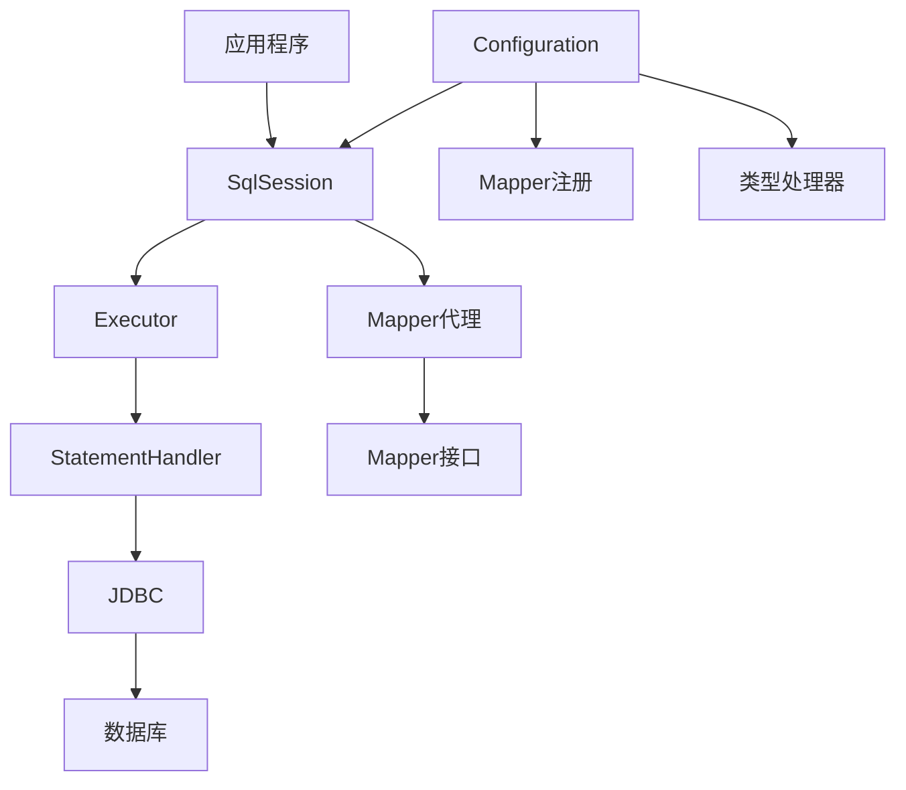

# MyBatis 快速学习指南（面试版）

> 目标：一天内掌握 MyBatis 核心知识点，应对面试

---

## 1. MyBatis 基础

### 1.1 什么是 MyBatis？

- **MyBatis** 是一个 Java 持久层框架，支持自定义 SQL、存储过程和高级映射
- **特点**：
  - 手写 SQL，灵活可控
  - 支持 XML 映射和注解两种方式
  - 结果集映射（ResultMap）
  - 动态 SQL
  - 插件机制（如分页插件）

### 1.2 ORM 对比

| 框架 | 特点 | 适用场景 |
|------|------|----------|
| **MyBatis** | 手写 SQL，灵活 | 复杂查询、性能要求高 |
| **JPA/Hibernate** | 自动生成 SQL | 快速开发、简单查询 |
| **MyBatis-Plus** | MyBatis 增强，自动 CRUD | 兼顾灵活与效率 |

---

## 2. 核心组件

### 2.1 架构图



### 2.2 核心组件说明

| 组件 | 作用 |
|------|------|
| **SqlSession** | 与数据库交互的会话，提供增删改查方法 |
| **Executor** | SQL 执行器，负责 SQL 语句的执行和缓存管理 |
| **StatementHandler** | 处理 JDBC Statement，设置参数、执行 SQL |
| **ResultSetHandler** | 处理结果集，将结果映射为 Java 对象 |
| **TypeHandler** | Java 类型与 JDBC 类型的转换 |
| **MapperProxy** | Mapper 接口的动态代理实现 |

---

## 3. Mapper 接口与 XML

### 3.1 Mapper 接口

```java
// 项目路径: mall-mbg/src/main/java/com/macro/mall/mapper/UmsAdminMapper.java
public interface UmsAdminMapper {
    // 根据主键查询
    UmsAdmin selectByPrimaryKey(Long id);
    
    // 根据条件查询列表
    List<UmsAdmin> selectByExample(UmsAdminExample example);
    
    // 插入（选择性字段）
    int insertSelective(UmsAdmin row);
    
    // 更新（选择性字段）
    int updateByPrimaryKeySelective(UmsAdmin row);
    
    // 删除
    int deleteByPrimaryKey(Long id);
}
```

### 3.2 Mapper XML

```xml
<!-- 项目路径: mall-mbg/src/main/resources/mapper/UmsAdminMapper.xml -->
<?xml version="1.0" encoding="UTF-8"?>
<!DOCTYPE mapper PUBLIC "-//mybatis.org//DTD Mapper 3.0//EN" 
                        "http://mybatis.org/dtd/mybatis-3-mapper.dtd">
<mapper namespace="com.macro.mall.mapper.UmsAdminMapper">
    
    <!-- 结果集映射 -->
    <resultMap id="BaseResultMap" type="com.macro.mall.model.UmsAdmin">
        <id column="id" property="id" />
        <result column="username" property="username" />
        <result column="password" property="password" />
        <result column="icon" property="icon" />
        <result column="email" property="email" />
    </resultMap>
    
    <!-- 查询列 -->
    <sql id="Base_Column_List">
        id, username, password, icon, email, nick_name, note, create_time, 
        login_time, status
    </sql>
    
    <!-- 根据主键查询 -->
    <select id="selectByPrimaryKey" resultMap="BaseResultMap">
        select 
        <include refid="Base_Column_List" />
        from ums_admin
        where id = #{id,jdbcType=BIGINT}
    </select>
    
    <!-- 插入（选择性） -->
    <insert id="insertSelective" parameterType="com.macro.mall.model.UmsAdmin">
        insert into ums_admin
        <trim prefix="(" suffix=")" suffixOverrides=",">
            <if test="id != null">id,</if>
            <if test="username != null">username,</if>
            <if test="password != null">password,</if>
        </trim>
        <trim prefix="values (" suffix=")" suffixOverrides=",">
            <if test="id != null">#{id,jdbcType=BIGINT},</if>
            <if test="username != null">#{username,jdbcType=VARCHAR},</if>
            <if test="password != null">#{password,jdbcType=VARCHAR},</if>
        </trim>
    </insert>
</mapper>
```

---

## 4. 动态 SQL

### 4.1 常用标签

| 标签 | 作用 | 示例 |
|------|------|------|
| `<if>` | 条件判断 | `<if test="username != null">AND username = #{username}</if>` |
| `<choose>` | 多选一 | `<choose><when><otherwise>` |
| `<where>` | 智能 WHERE 子句 | 自动去除多余 AND/OR |
| `<set>` | 智能 SET 子句 | 自动去除多余逗号 |
| `<foreach>` | 遍历集合 | 批量插入、IN 查询 |
| `<trim>` | 自定义标签 | 去除前缀、后缀 |
| `<include>` | 引用 SQL 片段 | `<include refid="Base_Column_List" />` |

### 4.2 动态 SQL 示例

```xml
<!-- 项目路径: mall-admin/src/main/resources/dao/PmsProductDao.xml -->
<select id="queryList" resultMap="com.macro.mall.mapper.PmsProductMapper.BaseResultMap">
    SELECT
        <include refid="Base_Column_List" />
    FROM pms_product
    <where>
        <if test="productCategoryId != null">
            AND product_category_id = #{productCategoryId}
        </if>
        <if test="brandId != null">
            AND brand_id = #{brandId}
        </if>
        <if test="keyword != null">
            AND (name LIKE CONCAT('%',#{keyword},'%') 
                 OR product_sn LIKE CONCAT('%',#{keyword},'%'))
        </if>
        <if test="publishStatus != null">
            AND publish_status = #{publishStatus}
        </if>
    </where>
    ORDER BY create_time DESC
</select>
```

### 4.3 批量插入

```xml
<!-- 项目路径: mall-admin/src/main/resources/dao/UmsAdminRoleRelationDao.xml -->
<insert id="insertList">
    INSERT INTO ums_admin_role_relation (admin_id, role_id) VALUES
    <foreach collection="list" separator="," item="item">
        (#{item.adminId,jdbcType=BIGINT}, #{item.roleId,jdbcType=BIGINT})
    </foreach>
</insert>
```

---

## 5. ResultMap 结果映射

### 5.1 基本映射

```xml
<resultMap id="BaseResultMap" type="com.macro.mall.model.UmsAdmin">
    <id column="id" property="id" />
    <result column="username" property="username" />
    <result column="password" property="password" />
    <result column="icon" property="icon" />
    <result column="email" property="email" />
</resultMap>
```

### 5.2 关联映射（一对一）

```xml
<resultMap id="OrderDetailResultMap" type="com.macro.mall.domain.OmsOrderDetail">
    <id column="order_id" property="orderId" />
    <result column="order_sn" property="orderSn" />
    <!-- 关联用户信息 -->
    <association property="member" javaType="com.macro.mall.model.UmsMember">
        <id column="member_id" property="id" />
        <result column="member_username" property="username" />
    </association>
</resultMap>
```

### 5.3 集合映射（一对多）

```xml
<resultMap id="OrderDetailResultMap" type="com.macro.mall.domain.OmsOrderDetail">
    <id column="order_id" property="orderId" />
    <result column="order_sn" property="orderSn" />
    <!-- 关联订单商品列表 -->
    <collection property="orderItemList" ofType="com.macro.mall.model.OmsOrderItem">
        <id column="item_id" property="id" />
        <result column="product_name" property="productName" />
        <result column="quantity" property="quantity" />
    </collection>
</resultMap>
```

---

## 6. MyBatis Generator

### 6.1 什么是 MBG？

- **MyBatis Generator（MBG）** 是 MyBatis 官方提供的代码生成器
- 自动生成：Model 类、Mapper 接口、Mapper XML
- 支持：MySQL、Oracle、SQL Server 等数据库

### 6.2 项目中的使用

```java
// 项目路径: mall-mbg/src/main/java/com/macro/mall/Generator.java
public class Generator {
    public static void main(String[] args) throws Exception {
        List<String> warnings = new ArrayList<>();
        boolean overwrite = true;
        File configFile = new File("generatorConfig.xml");
        ConfigurationParser cp = new ConfigurationParser(warnings);
        Configuration config = cp.parseConfiguration(configFile);
        DefaultShellCallback callback = new DefaultShellCallback(overwrite);
        MyBatisGenerator myBatisGenerator = new MyBatisGenerator(config, callback, warnings);
        myBatisGenerator.generate(null);
    }
}
```

### 6.3 生成的文件结构

```
mall-mbg/
├── src/main/java/com/macro/mall/
│   ├── mapper/          # Mapper接口
│   │   ├── UmsAdminMapper.java
│   │   ├── PmsProductMapper.java
│   │   └── ...
│   └── model/           # Model类
│       ├── UmsAdmin.java
│       ├── UmsAdminExample.java  # 条件查询构建器
│       ├── PmsProduct.java
│       └── ...
└── src/main/resources/
    └── mapper/          # Mapper XML
        ├── UmsAdminMapper.xml
        ├── PmsProductMapper.xml
        └── ...
```

---

## 7. 分页插件 PageHelper

### 7.1 使用方式

```java
// 项目路径: mall-admin/src/main/java/com/macro/mall/service/impl/UmsAdminServiceImpl.java
@Override
public List<UmsAdmin> list(String keyword, Integer pageSize, Integer pageNum) {
    // 开启分页
    PageHelper.startPage(pageNum, pageSize);
    
    // 构建查询条件
    UmsAdminExample example = new UmsAdminExample();
    UmsAdminExample.Criteria criteria = example.createCriteria();
    
    if (!StringUtils.isEmpty(keyword)) {
        criteria.andUsernameLike("%" + keyword + "%");
        example.or().andNickNameLike("%" + keyword + "%");
    }
    
    // 查询（自动分页）
    return adminMapper.selectByExample(example);
}
```

### 7.2 返回分页结果

```java
// 项目路径: mall-admin/src/main/java/com/macro/mall/controller/UmsAdminController.java
@RequestMapping(value = "/list", method = RequestMethod.GET)
public CommonResult<CommonPage<UmsAdmin>> list(
    @RequestParam(value = "keyword", required = false) String keyword,
    @RequestParam(value = "pageSize", defaultValue = "5") Integer pageSize,
    @RequestParam(value = "pageNum", defaultValue = "1") Integer pageNum) {
    
    List<UmsAdmin> adminList = adminService.list(keyword, pageSize, pageNum);
    return CommonResult.success(CommonPage.restPage(adminList));
}
```

```java
// 项目路径: mall-common/src/main/java/com/macro/mall/common/api/CommonPage.java
public static <T> CommonPage<T> restPage(List<T> list) {
    CommonPage<T> result = new CommonPage<>();
    PageInfo<T> pageInfo = new PageInfo<>(list);
    result.setPageNum(pageInfo.getPageNum());
    result.setPageSize(pageInfo.getPageSize());
    result.setTotalPage(pageInfo.getPages());
    result.setTotal(pageInfo.getTotal());
    result.setList(pageInfo.getList());
    return result;
}
```

---

## 8. 自定义 DAO

### 8.1 自定义查询

```java
// 项目路径: mall-admin/src/main/java/com/macro/mall/dao/OmsOrderDao.java
public interface OmsOrderDao {
    List<OmsOrder> getList(OmsOrderQueryParam queryParam);
}
```

```xml
<!-- 项目路径: mall-admin/src/main/resources/dao/OmsOrderDao.xml -->
<mapper namespace="com.macro.mall.dao.OmsOrderDao">
    <select id="getList" resultMap="com.macro.mall.mapper.OmsOrderMapper.BaseResultMap">
        SELECT
            o.*
        FROM oms_order o
        <where>
            <if test="memberId != null">AND o.member_id = #{memberId}</if>
            <if test="orderSn != null">AND o.order_sn = #{orderSn}</if>
            <if test="status != null">AND o.status = #{status}</if>
            <if test="createTime != null">AND o.create_time >= #{createTime}</if>
        </where>
        ORDER BY o.create_time DESC
    </select>
</mapper>
```

---

## 9. 面试常问问题

### 9.1 MyBatis 的工作原理？

**答案要点**：
1. 加载配置文件（mybatis-config.xml、Mapper XML）
2. 创建 SqlSessionFactory
3. 获取 SqlSession
4. 通过动态代理获取 Mapper 接口实现
5. 执行 SQL，返回结果

### 9.2 #{} 和 ${} 的区别？

**答案要点**：
- `#{}`：预编译参数，安全防 SQL 注入
- `${}`：字符串替换，有 SQL 注入风险，用于动态表名、排序字段

### 9.3 MyBatis 的缓存机制？

**答案要点**：
1. **一级缓存**（默认开启）：SqlSession 级别的缓存，同一个 SqlSession 内相同查询结果缓存
2. **二级缓存**（需配置）：Mapper 级别的缓存，不同 SqlSession 共享，需要实体类实现 Serializable

### 9.4 MyBatis 如何实现分页？

**答案要点**：
1. **PageHelper 插件**（推荐）：拦截 SQL，自动添加 LIMIT
2. **手写分页 SQL**：在 XML 中使用 LIMIT

### 9.5 MyBatis 和 Hibernate 的区别？

**答案要点**：
| 特性 | MyBatis | Hibernate |
|------|---------|-----------|
| SQL 控制 | 手写 SQL，灵活 | 自动生成，不够灵活 |
| 学习成本 | 低 | 高 |
| 性能 | 高（可优化 SQL） | 中等 |
| 适用场景 | 复杂查询、性能要求高 | 快速开发、简单业务 |

### 9.6 MyBatis 的接口绑定有几种方式？

**答案要点**：
1. **XML 方式**：Mapper 接口 + XML 文件，通过 namespace 绑定
2. **注解方式**：在接口方法上使用 `@Select`、`@Insert` 等注解

### 9.7 MyBatis 的 TypeHandler 作用？

**答案要点**：
- 实现 Java 类型与 JDBC 类型之间的转换
- 可自定义 TypeHandler 处理特殊类型（如 JSON 字段）

### 9.8 MyBatis 如何处理事务？

**答案要点**：
1. **编程式事务**：SqlSession.beginTransaction() / commit() / rollback()
2. **声明式事务**：Spring 的 `@Transactional` 注解（推荐）

---

## 10. 快速学习清单

| 优先级 | 学习内容 | 时间建议 |
|--------|----------|----------|
| 1 | Mapper 接口与 XML 映射 | 30分钟 |
| 2 | 动态 SQL 标签 | 30分钟 |
| 3 | ResultMap 结果映射 | 30分钟 |
| 4 | MyBatis Generator | 20分钟 |
| 5 | PageHelper 分页 | 20分钟 |
| 6 | 缓存机制 | 20分钟 |
| 7 | 面试常问问题背诵 | 30分钟 |

---

## 11. 关键代码路径

| 路径 | 说明 |
|------|------|
| `mall-mbg/src/main/java/com/macro/mall/mapper/UmsAdminMapper.java` | Mapper接口示例 |
| `mall-mbg/src/main/java/com/macro/mall/model/UmsAdmin.java` | Model类示例 |
| `mall-mbg/src/main/java/com/macro/mall/Generator.java` | MBG代码生成器 |
| `mall-admin/src/main/java/com/macro/mall/config/MyBatisConfig.java` | MyBatis配置 |
| `mall-admin/src/main/resources/dao/OmsOrderDao.xml` | 自定义DAO XML |
| `mall-admin/src/main/java/com/macro/mall/service/impl/UmsAdminServiceImpl.java` | PageHelper使用 |
| `mall-common/src/main/java/com/macro/mall/common/api/CommonPage.java` | 分页结果封装 |