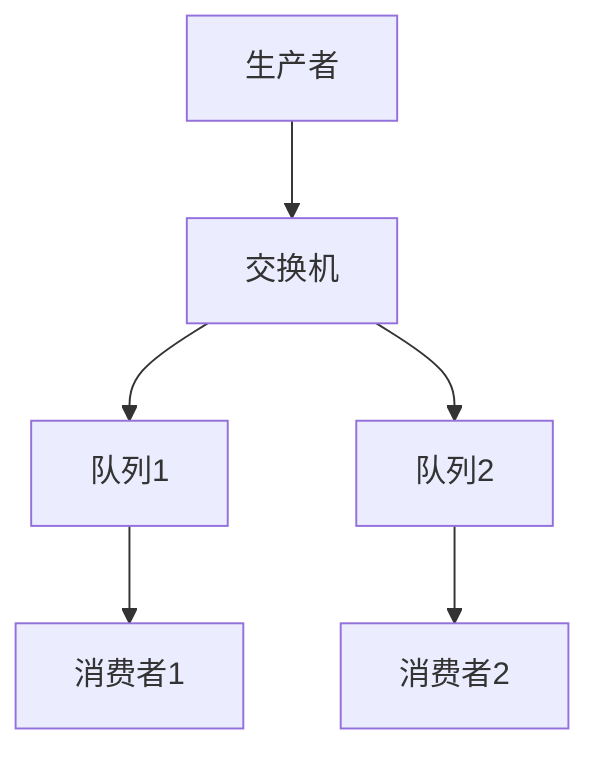
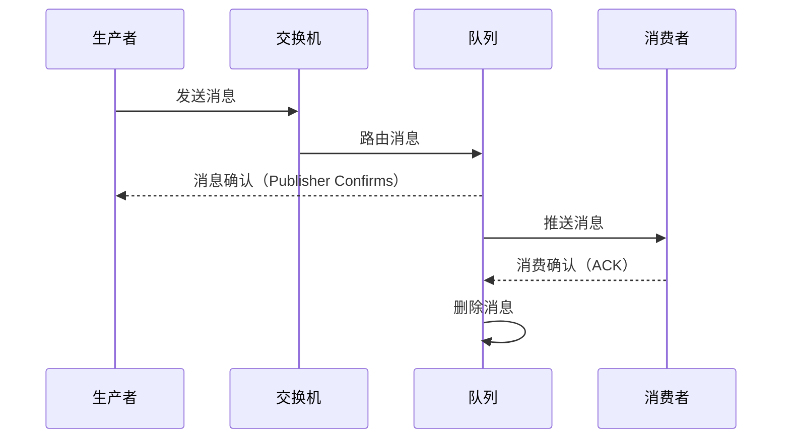
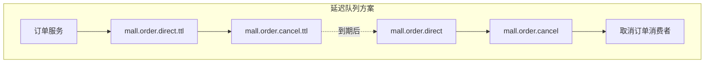

# RabbitMQ 快速学习指南（面试版）

> 目标：一天内掌握 RabbitMQ 核心知识点，应对面试

---

## 1. RabbitMQ 基础

### 1.1 什么是 RabbitMQ？

- **RabbitMQ** 是一个基于 AMQP（高级消息队列协议）的消息中间件
- **特点**：
  - 可靠性：支持消息持久化、确认机制
  - 灵活路由：支持多种交换机类型
  - 集群支持：高可用部署
  - 管理界面：Web 管理控制台

### 1.2 核心概念

| 概念 | 说明 |
|------|------|
| **Producer** | 生产者，发送消息的应用 |
| **Consumer** | 消费者，接收消息的应用 |
| **Queue** | 队列，存储消息的容器 |
| **Exchange** | 交换机，路由消息到队列 |
| **Binding** | 绑定，将交换机和队列关联 |
| **Routing Key** | 路由键，匹配消息路由规则 |

---

## 2. 消息模型



### 2.1 交换机类型

| 类型 | 说明 | 示例 |
|------|------|------|
| **Direct** | 精确匹配路由键 | `mall.order.cancel` |
| **Topic** | 模糊匹配路由键（支持 `*` 和 `#`） | `order.*`, `order.#` |
| **Fanout** | 广播到所有绑定的队列 | 日志系统 |
| **Headers** | 根据消息头匹配（较少使用） | - |

### 2.2 消息确认机制



---

## 3. 项目中的 RabbitMQ 应用

### 3.1 订单超时取消（延迟队列）



### 3.2 配置类

```java
// 项目路径: mall-portal/src/main/java/com/macro/mall/portal/config/RabbitMqConfig.java
@Configuration
public class RabbitMqConfig {

    // 订单消息实际消费交换机
    @Bean
    DirectExchange orderDirect() {
        return ExchangeBuilder
                .directExchange(QueueEnum.QUEUE_ORDER_CANCEL.getExchange())
                .durable(true)
                .build();
    }

    // 订单延迟队列交换机
    @Bean
    DirectExchange orderTtlDirect() {
        return ExchangeBuilder
                .directExchange(QueueEnum.QUEUE_TTL_ORDER_CANCEL.getExchange())
                .durable(true)
                .build();
    }

    // 订单实际消费队列
    @Bean
    public Queue orderQueue() {
        return new Queue(QueueEnum.QUEUE_ORDER_CANCEL.getName());
    }

    // 订单延迟队列（死信队列）
    @Bean
    public Queue orderTtlQueue() {
        return QueueBuilder
                .durable(QueueEnum.QUEUE_TTL_ORDER_CANCEL.getName())
                // 到期后转发的交换机
                .withArgument("x-dead-letter-exchange", QueueEnum.QUEUE_ORDER_CANCEL.getExchange())
                // 到期后转发的路由键
                .withArgument("x-dead-letter-routing-key", QueueEnum.QUEUE_ORDER_CANCEL.getRouteKey())
                .build();
    }

    // 绑定实际队列
    @Bean
    Binding orderBinding(DirectExchange orderDirect, Queue orderQueue) {
        return BindingBuilder.bind(orderQueue)
                .to(orderDirect)
                .with(QueueEnum.QUEUE_ORDER_CANCEL.getRouteKey());
    }

    // 绑定延迟队列
    @Bean
    Binding orderTtlBinding(DirectExchange orderTtlDirect, Queue orderTtlQueue) {
        return BindingBuilder.bind(orderTtlQueue)
                .to(orderTtlDirect)
                .with(QueueEnum.QUEUE_TTL_ORDER_CANCEL.getRouteKey());
    }
}
```

### 3.3 消息发送者

```java
// 项目路径: mall-portal/src/main/java/com/macro/mall/portal/component/CancelOrderSender.java
@Component
public class CancelOrderSender {
    @Autowired
    private AmqpTemplate amqpTemplate;

    public void sendMessage(Long orderId, final long delayTimes) {
        // 给延迟队列发送消息
        amqpTemplate.convertAndSend(
            QueueEnum.QUEUE_TTL_ORDER_CANCEL.getExchange(),
            QueueEnum.QUEUE_TTL_ORDER_CANCEL.getRouteKey(),
            orderId,
            new MessagePostProcessor() {
                @Override
                public Message postProcessMessage(Message message) throws AmqpException {
                    // 给消息设置延迟毫秒值
                    message.getMessageProperties().setExpiration(String.valueOf(delayTimes));
                    return message;
                }
            }
        );
    }
}
```

### 3.4 消息消费者

```java
// 项目路径: mall-portal/src/main/java/com/macro/mall/portal/component/CancelOrderReceiver.java
@Component
@RabbitListener(queues = "mall.order.cancel")
public class CancelOrderReceiver {
    @Autowired
    private OmsPortalOrderService portalOrderService;

    @RabbitHandler
    public void handle(Long orderId) {
        portalOrderService.cancelOrder(orderId);
    }
}
```

### 3.5 在业务中的使用

```java
// 项目路径: mall-portal/src/main/java/com/macro/mall/portal/service/impl/OmsPortalOrderServiceImpl.java
@Override
public int generateOrder(OrderParam orderParam) {
    // ... 创建订单逻辑 ...
    
    // 发送延迟消息，30分钟后取消订单
    if (order.getStatus().equals(0)) {
        cancelOrderSender.sendMessage(order.getId(), 30 * 60 * 1000);
    }
    
    return order.getId().intValue();
}
```

---

## 4. 延迟队列实现方案

### 4.1 方案对比

| 方案 | 实现方式 | 优点 | 缺点 |
|------|----------|------|------|
| **死信队列** | 设置队列的 TTL 和死信交换机 | 官方支持，稳定可靠 | 延迟时间固定 |
| **消息 TTL** | 给每条消息设置 expiration | 灵活控制延迟时间 | 消息堆积问题 |
| **RabbitMQ Delayed Message Plugin** | 安装延迟消息插件 | 功能完善 | 需要额外安装插件 |

### 4.2 项目采用的方案

项目采用**消息 TTL + 死信队列**组合方案：
1. 消息发送到延迟队列（`mall.order.cancel.ttl`）
2. 消息设置 TTL（30分钟）
3. TTL 到期后，消息变为死信
4. 死信被转发到实际消费队列（`mall.order.cancel`）
5. 消费者监听实际队列，处理取消订单业务

---

## 5. 消息可靠性

### 5.1 消息持久化

```java
// 队列持久化
@Bean
public Queue orderQueue() {
    // durable(true) 表示队列持久化
    return new Queue(QueueEnum.QUEUE_ORDER_CANCEL.getName(), true);
}

// 消息持久化（默认持久化）
amqpTemplate.convertAndSend(exchange, routeKey, message);
// MessageProperties 默认 deliveryMode = PERSISTENT
```

### 5.2 生产者确认

```java
// application.yml 配置
spring:
  rabbitmq:
    publisher-confirms: true
    publisher-returns: true

// 配置回调
@Configuration
public class RabbitConfirmConfig {
    @Autowired
    private RabbitTemplate rabbitTemplate;

    @PostConstruct
    public void init() {
        // 消息发送到交换机确认回调
        rabbitTemplate.setConfirmCallback((correlationData, ack, cause) -> {
            if (!ack) {
                // 消息发送失败，进行重试或记录日志
                log.error("消息发送失败: {}", cause);
            }
        });

        // 消息路由失败回调
        rabbitTemplate.setReturnCallback((message, replyCode, replyText, exchange, routingKey) -> {
            log.error("消息路由失败: {}", message);
        });
    }
}
```

### 5.3 消费者确认

```java
// application.yml 配置
spring:
  rabbitmq:
    listener:
      simple:
        acknowledge-mode: manual  # 手动确认

// 消费者手动确认
@RabbitHandler
public void handle(Long orderId, Channel channel, Message message) {
    try {
        portalOrderService.cancelOrder(orderId);
        // 手动确认消息
        channel.basicAck(message.getMessageProperties().getDeliveryTag(), false);
    } catch (Exception e) {
        // 消息处理失败，重新入队
        channel.basicNack(message.getMessageProperties().getDeliveryTag(), false, true);
    }
}
```

---

## 6. 消息幂等性

### 6.1 问题

- 消费者收到重复消息
- 原因：网络重试、ACK 丢失等

### 6.2 解决方案

```java
// 使用 Redis 实现幂等
@Override
public void cancelOrder(Long orderId) {
    String lockKey = "order:cancel:" + orderId;
    
    // 尝试获取锁（SETNX）
    Boolean success = redisService.setIfAbsent(lockKey, "1", 30);
    if (!success) {
        // 已处理过，直接返回
        return;
    }
    
    try {
        // 查询订单状态
        OmsOrder order = orderMapper.selectByPrimaryKey(orderId);
        if (order != null && order.getStatus().equals(0)) {
            // 更新订单为已取消
            order.setStatus(4);
            orderMapper.updateByPrimaryKeySelective(order);
            
            // 恢复库存
            // ...
        }
    } finally {
        // 释放锁
        redisService.del(lockKey);
    }
}
```

---

## 7. 面试常问问题

### 7.1 RabbitMQ 的工作原理？

**答案要点**：
1. 生产者发送消息到交换机（Exchange）
2. 交换机根据路由键（Routing Key）和绑定规则路由到队列
3. 队列存储消息，等待消费者消费
4. 消费者从队列获取消息并确认（ACK）
5. 队列收到确认后删除消息

### 7.2 交换机有哪些类型？

**答案要点**：
- **Direct**：精确匹配路由键
- **Topic**：模糊匹配（`*` 匹配一个词，`#` 匹配多个词）
- **Fanout**：广播到所有绑定队列
- **Headers**：根据消息头匹配

### 7.3 如何保证消息不丢失？

**答案要点**：
1. **持久化**：队列持久化（durable=true）、消息持久化（deliveryMode=2）
2. **生产者确认**：Publisher Confirms + Returns
3. **消费者确认**：手动 ACK（acknowledge-mode=manual）
4. **死信队列**：处理消费失败的消息

### 7.4 如何实现延迟队列？

**答案要点**：
1. **死信队列**：设置队列的 `x-dead-letter-exchange` 和 `x-dead-letter-routing-key`
2. **消息 TTL**：设置消息的 `expiration` 属性
3. **延迟插件**：安装 RabbitMQ Delayed Message Plugin

### 7.5 如何保证消息的幂等性？

**答案要点**：
1. **唯一 ID**：消息携带唯一标识
2. **Redis/数据库去重**：消费前检查是否已处理
3. **数据库唯一约束**：利用主键或唯一索引

### 7.6 RabbitMQ 和 Kafka 的区别？

**答案要点**：
| 特性 | RabbitMQ | Kafka |
|------|----------|-------|
| 协议 | AMQP | 自定义协议 |
| 吞吐量 | 万级 | 十万级 |
| 持久化 | 消息级别 | 分区级别 |
| 消费模式 | Push/Pull | Pull |
| 适用场景 | 实时性要求高、可靠性要求高 | 大数据、日志收集 |

### 7.7 RabbitMQ 的消息确认机制？

**答案要点**：
1. **生产者确认**：消息发送到交换机后确认（Confirm），路由失败回调（Return）
2. **消费者确认**：消费完成后手动 ACK，未确认消息会重新投递

---

## 8. 快速学习清单

| 优先级 | 学习内容 | 时间建议 |
|--------|----------|----------|
| 1 | 核心概念（Producer/Consumer/Queue/Exchange） | 20分钟 |
| 2 | 交换机类型及路由规则 | 20分钟 |
| 3 | 项目中的延迟队列实现 | 30分钟 |
| 4 | 消息可靠性机制 | 30分钟 |
| 5 | 消息幂等性 | 20分钟 |
| 6 | 面试常问问题背诵 | 30分钟 |

---

## 9. 关键代码路径

| 路径 | 说明 |
|------|------|
| `mall-portal/src/main/java/com/macro/mall/portal/config/RabbitMqConfig.java` | RabbitMQ 配置 |
| `mall-portal/src/main/java/com/macro/mall/portal/component/CancelOrderSender.java` | 消息发送者 |
| `mall-portal/src/main/java/com/macro/mall/portal/component/CancelOrderReceiver.java` | 消息消费者 |
| `mall-portal/src/main/java/com/macro/mall/portal/service/impl/OmsPortalOrderServiceImpl.java` | 业务中使用 |
| `mall-portal/src/main/java/com/macro/mall/portal/domain/QueueEnum.java` | 队列枚举定义 |