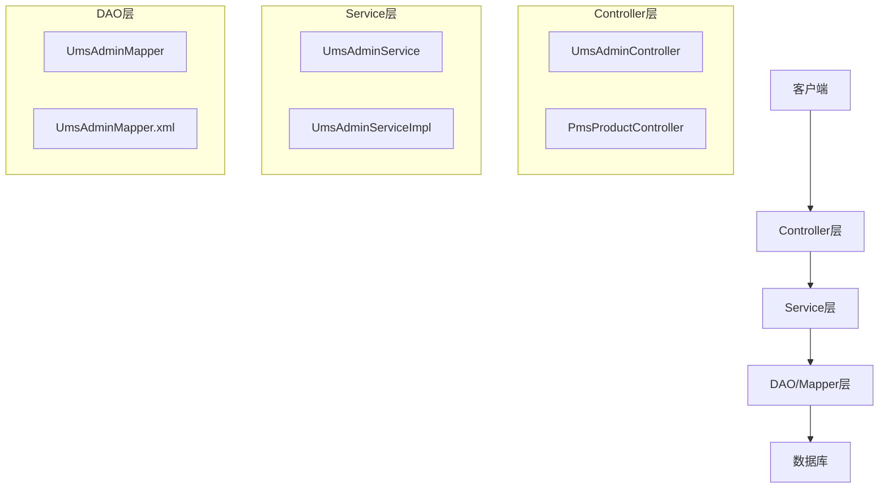
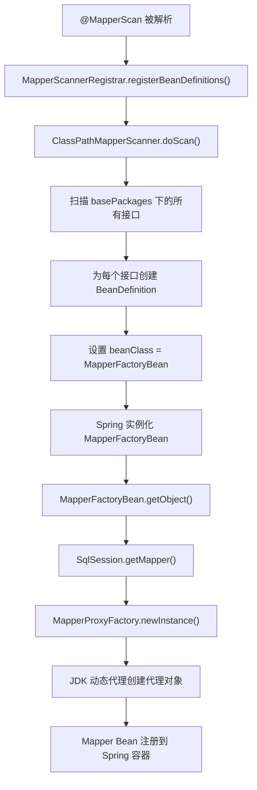
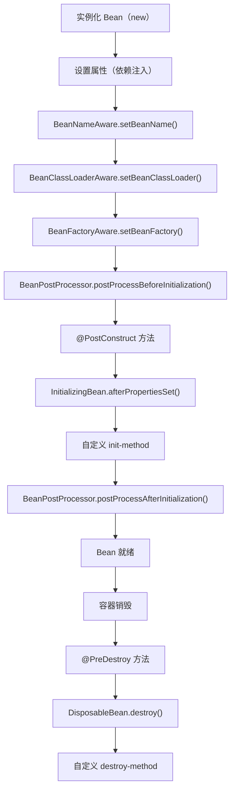
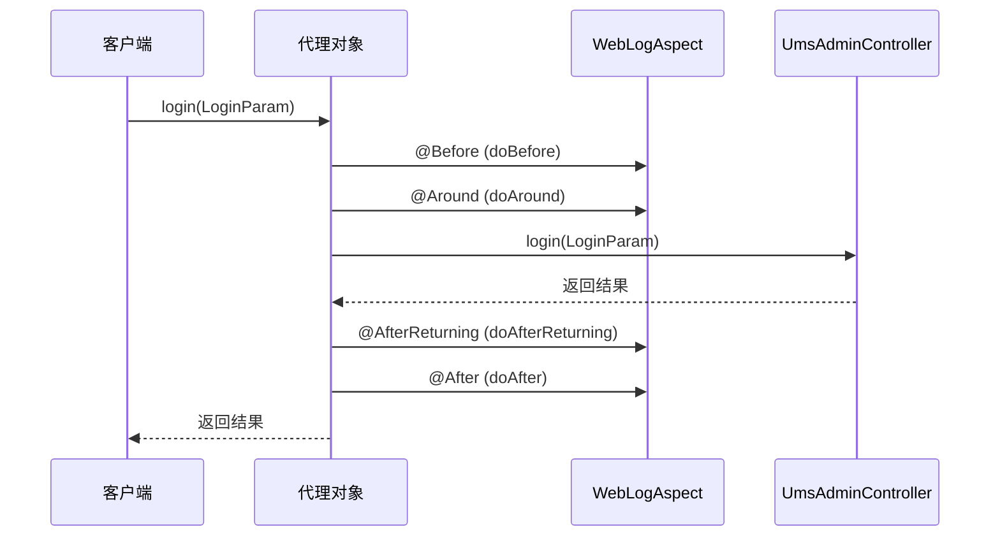

# Spring Boot 快速学习指南（面试版）

> 目标：一天内掌握 Spring Boot 核心知识点，应对面试

---

## 1. 核心概念

### 1.1 什么是 Spring Boot？

- **Spring Boot** 是 Spring 框架的简化版，通过自动配置（Auto Configuration）消除大量样板代码
- **核心思想**：约定大于配置（Convention over Configuration）
- **三个核心特性**：
  1. **自动配置**：根据依赖自动配置 Spring 应用
  2. **起步依赖**：Maven/Gradle 依赖打包，一键引入所需功能
  3. **命令行界面**：快速运行、测试、打包应用

### 1.2 启动类

```java
// 项目路径: mall-admin/src/main/java/com/macro/mall/MallAdminApplication.java
@SpringBootApplication
public class MallAdminApplication {
    public static void main(String[] args) {
        SpringApplication.run(MallAdminApplication.class, args);
    }
}
```

**@SpringBootApplication 包含三个注解**：
- `@SpringBootConfiguration`：等同于 `@Configuration`，声明配置类
- `@EnableAutoConfiguration`：开启自动配置
- `@ComponentScan`：扫描当前包及子包的组件

### 1.3 配置文件

```yaml
# 项目路径: mall-admin/src/main/resources/application.yml
server:
  port: 8080

spring:
  datasource:
    url: jdbc:mysql://localhost:3306/mall?useUnicode=true&characterEncoding=utf-8&serverTimezone=Asia/Shanghai
    username: root
    password: root
    driver-class-name: com.mysql.cj.jdbc.Driver
```

**配置优先级**：
1. 命令行参数 > 2. 外部配置文件 > 3. 内部配置文件 > 4. 默认值

---

## 2. 核心注解

| 注解 | 作用 | 示例 |
|------|------|------|
| `@RestController` | 组合 `@Controller` + `@ResponseBody` | `UmsAdminController` |
| `@Controller` | 声明控制器，返回视图 | - |
| `@Service` | 声明服务层 | `UmsAdminService` |
| `@Repository` | 声明数据访问层 | Mapper 接口 |
| `@Component` | 通用组件声明 | 工具类 |
| `@Configuration` | 声明配置类 | `MyBatisConfig` |
| `@Bean` | 声明 Bean | `@Bean public RedisTemplate redisTemplate()` |
| `@Autowired` | 依赖注入（按类型） | `@Autowired UmsAdminService adminService` |
| `@Resource` | 依赖注入（按名称） | `@Resource(name="redisTemplate")` |
| `@Value` | 读取配置值 | `@Value("${jwt.secret}")` |
| `@Transactional` | 声明事务 | `@Transactional(rollbackFor = Exception.class)` |
| `@RequestMapping` | 映射请求路径 | `@RequestMapping("/admin")` |
| `@GetMapping` | GET 请求 | `@GetMapping("/list")` |
| `@PostMapping` | POST 请求 | `@PostMapping("/login")` |
| `@PathVariable` | 获取路径参数 | `@PathVariable Long id` |
| `@RequestParam` | 获取查询参数 | `@RequestParam String keyword` |
| `@RequestBody` | 获取请求体 | `@RequestBody UmsAdminParam param` |

---

## 3. 分层架构



**代码路径示例**：

| 层级 | 文件路径 |
|------|----------|
| Controller | `mall-admin/src/main/java/com/macro/mall/controller/UmsAdminController.java` |
| Service接口 | `mall-admin/src/main/java/com/macro/mall/service/UmsAdminService.java` |
| Service实现 | `mall-admin/src/main/java/com/macro/mall/service/impl/UmsAdminServiceImpl.java` |
| Mapper接口 | `mall-mbg/src/main/java/com/macro/mall/mapper/UmsAdminMapper.java` |
| Mapper XML | `mall-mbg/src/main/resources/mapper/UmsAdminMapper.xml` |

---

## 4. 自动配置原理

### 4.1 工作流程

```
Spring Boot启动 → @EnableAutoConfiguration → 扫描 META-INF/spring.factories → 加载自动配置类 → 条件判断 → 注册Bean
```

### 4.2 spring.factories 内容示例

```properties
# spring-boot-autoconfigure 中的 spring.factories
org.springframework.boot.autoconfigure.EnableAutoConfiguration=\
org.springframework.boot.autoconfigure.data.redis.RedisAutoConfiguration,\
org.springframework.boot.autoconfigure.security.servlet.SecurityAutoConfiguration,\
org.springframework.boot.autoconfigure.web.servlet.WebMvcAutoConfiguration,\
org.springframework.boot.autoconfigure.jdbc.DataSourceAutoConfiguration
```

### 4.3 条件注解

| 注解 | 条件 |
|------|------|
| `@ConditionalOnClass` | 类路径存在指定类 |
| `@ConditionalOnMissingClass` | 类路径不存在指定类 |
| `@ConditionalOnBean` | Spring容器存在指定Bean |
| `@ConditionalOnMissingBean` | Spring容器不存在指定Bean |
| `@ConditionalOnProperty` | 配置属性满足条件 |
| `@ConditionalOnWebApplication` | Web应用环境 |

### 4.4 自定义自动配置

```java
@Configuration
@ConditionalOnClass(RedisService.class)
@EnableConfigurationProperties(RedisProperties.class)
public class RedisAutoConfiguration {
    
    @Bean
    @ConditionalOnMissingBean
    public RedisService redisService(RedisTemplate redisTemplate) {
        return new RedisServiceImpl(redisTemplate);
    }
}
```

---

## 5. Mapper 的本质与 @MapperScan

### 5.1 Mapper 是什么？

**Mapper 是 DAO 层接口的动态代理对象。**

```java
// 接口定义
public interface UmsAdminMapper {
    UmsAdmin selectByPrimaryKey(Long id);
}

// 实际执行：JDK 动态代理拦截 → SqlSession → Executor → JDBC
```

### 5.2 @MapperScan 启动流程



### 5.3 MapperProxy 核心逻辑

```java
public class MapperProxy<T> implements InvocationHandler {
    
    @Override
    public Object invoke(Object proxy, Method method, Object[] args) throws Throwable {
        // 1. 如果是 Object 的方法（equals/hashCode/toString），直接调用
        if (Object.class.equals(method.getDeclaringClass())) {
            return method.invoke(this, args);
        }
        
        // 2. 获取或创建 MapperMethod
        MapperMethod mapperMethod = cachedMapperMethod(method);
        
        // 3. 执行 SQL 并返回结果
        return mapperMethod.execute(sqlSession, args);
    }
}
```

### 5.4 多数据源配置

```java
// 动态数据源路由
public class DynamicDataSource extends AbstractRoutingDataSource {
    @Override
    protected Object determineCurrentLookupKey() {
        return DataSourceContextHolder.getDataSourceType();
    }
}

// 数据源上下文
public class DataSourceContextHolder {
    private static final ThreadLocal<String> contextHolder = new ThreadLocal<>();
    
    public static void setDataSourceType(String dataSourceType) {
        contextHolder.set(dataSourceType);
    }
    
    public static String getDataSourceType() {
        return contextHolder.get();
    }
}

// 使用注解切换
@Target(ElementType.METHOD)
@Retention(RetentionPolicy.RUNTIME)
public @interface DataSource {
    String value() default "primary";
}

// AOP 切面
@Aspect
@Component
public class DataSourceAspect {
    @Before("@annotation(dataSource)")
    public void before(DataSource dataSource) {
        DataSourceContextHolder.setDataSourceType(dataSource.value());
    }
}
```

---

## 6. Bean 初始化流程

### 6.1 完整生命周期



### 6.2 Spring 内部代码流程

```java
// AbstractAutowireCapableBeanFactory.doCreateBean()
protected Object doCreateBean(String beanName, RootBeanDefinition mbd, Object[] args) {
    
    // 1. 实例化 Bean
    BeanWrapper instanceWrapper = createBeanInstance(beanName, mbd, args);
    Object bean = instanceWrapper.getWrappedInstance();
    
    // 2. 依赖注入
    populateBean(beanName, mbd, instanceWrapper);
    
    // 3. 初始化 Bean
    exposedObject = initializeBean(beanName, exposedObject, mbd);
    
    return exposedObject;
}

// initializeBean()
protected Object initializeBean(String beanName, Object bean, RootBeanDefinition mbd) {
    // 3.1 BeanNameAware 等回调
    invokeAwareMethods(beanName, bean);
    
    // 3.2 BeanPostProcessor.postProcessBeforeInitialization()
    Object wrappedBean = applyBeanPostProcessorsBeforeInitialization(bean, beanName);
    
    // 3.3 @PostConstruct / afterPropertiesSet / init-method
    invokeInitMethods(beanName, wrappedBean, mbd);
    
    // 3.4 BeanPostProcessor.postProcessAfterInitialization()（AOP 创建代理）
    wrappedBean = applyBeanPostProcessorsAfterInitialization(wrappedBean, beanName);
    
    return wrappedBean;
}
```

### 6.3 BeanPostProcessor 扩展 Hook

| BeanPostProcessor | 作用 |
|-------------------|------|
| **AnnotationAwareAspectJAutoProxyCreator** | 创建 AOP 代理对象 |
| **AutowiredAnnotationBeanPostProcessor** | 处理 @Autowired 依赖注入 |
| **CommonAnnotationBeanPostProcessor** | 处理 @PostConstruct / @PreDestroy |
| **ConfigurationClassPostProcessor** | 处理 @Configuration 类 |

### 6.4 @PostConstruct 示例

```java
// 项目路径: mall-security/src/main/java/com/macro/mall/security/component/DynamicSecurityMetadataSource.java
public class DynamicSecurityMetadataSource {
    
    @Autowired
    private DynamicSecurityService dynamicSecurityService;
    
    @PostConstruct  // 依赖注入完成后执行
    public void loadDataSource() {
        configAttributeMap = dynamicSecurityService.loadDataSource();
    }
}
```

---

## 7. 动态代理原理

### 7.1 JDK 动态代理

```java
// JDK 动态代理生成的代理类结构
public class $Proxy0 implements UmsAdminMapper {
    private InvocationHandler h;
    
    public UmsAdmin selectByPrimaryKey(Long id) {
        Method method = UmsAdminMapper.class.getMethod("selectByPrimaryKey", Long.class);
        return (UmsAdmin) h.invoke(this, method, new Object[]{id});
    }
}

// InvocationHandler
public class MapperProxy<T> implements InvocationHandler {
    @Override
    public Object invoke(Object proxy, Method method, Object[] args) throws Throwable {
        // 拦截逻辑
        return mapperMethod.execute(sqlSession, args);
    }
}
```

### 7.2 CGLIB 代理

```java
public class CglibProxy implements MethodInterceptor {
    private Object target;
    
    @Override
    public Object intercept(Object obj, Method method, Object[] args, MethodProxy proxy) throws Throwable {
        // 前置增强
        Object result = proxy.invokeSuper(obj, args);
        // 后置增强
        return result;
    }
}
```

### 7.3 代理类在 JVM 内存中的位置

```
┌─────────────────────────────────────────────────────────────┐
│                        JVM 内存结构                          │
│                                                             │
│  Heap（堆内存）: 代理对象实例                                 │
│  MetaSpace（元空间）: 代理类的元数据（$Proxy0.class）          │
│  Application ClassLoader: 加载代理类                         │
└─────────────────────────────────────────────────────────────┘
```

### 7.4 动态代理 vs Override

| 特性 | Override（继承） | 动态代理（拦截） |
|------|------------------|------------------|
| 实现方式 | 重写父类方法 | 委托给 InvocationHandler |
| 运行时灵活性 | 编译期确定 | 运行时动态决定 |
| 逻辑修改 | 修改子类代码 | 修改 InvocationHandler |
| 适用场景 | 固定实现 | 横切关注点（日志、权限、事务） |

---

## 8. 事务管理

### 8.1 声明式事务

```java
// 项目路径: mall-admin/src/main/java/com/macro/mall/service/UmsAdminService.java
@Transactional
public int updateRole(Long adminId, List<Long> roleIds) {
    // 先删除旧的角色关系
    adminRoleRelationDao.deleteByAdminId(adminId);
    // 插入新的角色关系
    List<UmsAdminRoleRelation> relations = new ArrayList<>();
    for (Long roleId : roleIds) {
        UmsAdminRoleRelation relation = new UmsAdminRoleRelation();
        relation.setAdminId(adminId);
        relation.setRoleId(roleId);
        relations.add(relation);
    }
    return adminRoleRelationDao.insertList(relations);
}
```

### 8.2 事务传播行为

| 传播行为 | 说明 |
|----------|------|
| `REQUIRED`（默认） | 如果当前存在事务，则加入事务；否则新建事务 |
| `SUPPORTS` | 如果当前存在事务，则加入事务；否则以非事务方式执行 |
| `MANDATORY` | 如果当前存在事务，则加入事务；否则抛出异常 |
| `REQUIRES_NEW` | 新建事务，如果当前存在事务，则挂起当前事务 |
| `NOT_SUPPORTED` | 以非事务方式执行，如果当前存在事务，则挂起当前事务 |
| `NEVER` | 以非事务方式执行，如果当前存在事务，则抛出异常 |
| `NESTED` | 如果当前存在事务，则嵌套事务执行；否则新建事务 |

### 8.3 事务失效场景

```java
// 注意：同一个类内部调用事务方法不会生效
@Service
public class UserService {
    public void outer() {
        // 这里调用 inner() 不会触发事务（绕过代理）
        inner();
    }
    
    @Transactional
    public void inner() {
        // ...
    }
}
```

---

## 9. AOP（面向切面编程）

### 9.1 日志切面

```java
// 项目路径: mall-common/src/main/java/com/macro/mall/common/log/WebLogAspect.java
@Aspect
@Component
@Order(1)
public class WebLogAspect {
    
    private static final Logger LOGGER = LoggerFactory.getLogger(WebLogAspect.class);
    
    @Pointcut("execution(public * com.macro.mall.controller.*.*(..))")
    public void webLog() {}
    
    @Around("webLog()")
    public Object doAround(ProceedingJoinPoint joinPoint) throws Throwable {
        long startTime = System.currentTimeMillis();
        Object result = joinPoint.proceed();
        long endTime = System.currentTimeMillis();
        LOGGER.info("请求耗时: {}ms", endTime - startTime);
        return result;
    }
}
```

### 9.2 AOP 通知类型

| 通知类型 | 作用 |
|----------|------|
| `@Before` | 目标方法执行前 |
| `@After` | 目标方法执行后（无论是否异常） |
| `@AfterReturning` | 目标方法正常返回后 |
| `@AfterThrowing` | 目标方法抛出异常后 |
| `@Around` | 环绕通知（最强大，可控制执行） |

### 9.3 AOP 执行流程



---

## 10. 请求拦截机制

### 10.1 Filter（过滤器）

```java
// 项目路径: mall-security/src/main/java/com/macro/mall/security/component/JwtAuthenticationTokenFilter.java
public class JwtAuthenticationTokenFilter extends OncePerRequestFilter {
    
    @Override
    protected void doFilterInternal(HttpServletRequest request,
                                    HttpServletResponse response,
                                    FilterChain chain) throws ServletException, IOException {
        
        // 获取 Token
        String authHeader = request.getHeader("Authorization");
        
        // 验证 Token
        if (authHeader != null && authHeader.startsWith("Bearer ")) {
            String token = authHeader.substring(7);
            String username = jwtTokenUtil.getUserNameFromToken(token);
            // 设置用户信息到 SecurityContext
        }
        
        // 继续执行后续过滤器
        chain.doFilter(request, response);
    }
}
```

### 10.2 Interceptor（拦截器）

```java
@Component
public class MyInterceptor implements HandlerInterceptor {
    
    @Override
    public boolean preHandle(HttpServletRequest request, 
                            HttpServletResponse response, 
                            Object handler) throws Exception {
        // 请求处理前执行
        return true;
    }
}

// 注册拦截器
@Configuration
public class WebMvcConfig implements WebMvcConfigurer {
    @Autowired
    private MyInterceptor myInterceptor;
    
    @Override
    public void addInterceptors(InterceptorRegistry registry) {
        registry.addInterceptor(myInterceptor)
                .addPathPatterns("/**")
                .excludePathPatterns("/login");
    }
}
```

### 10.3 Filter vs Interceptor

| 特性 | Filter | Interceptor |
|------|--------|-------------|
| 底层 | Servlet 规范 | Spring MVC |
| 执行时机 | 请求进入 Servlet 之前 | Controller 方法执行前后 |
| 可访问对象 | HttpServletRequest/Response | HandlerMethod |
| 用途 | 全局拦截（编码、认证） | 业务拦截（日志、权限） |

---

## 11. 全局异常处理

```java
// 项目路径: mall-common/src/main/java/com/macro/mall/common/exception/GlobalExceptionHandler.java
@RestControllerAdvice
public class GlobalExceptionHandler {
    
    @ExceptionHandler(ApiException.class)
    public CommonResult handleApiException(ApiException e) {
        return CommonResult.failed(e.getErrorCode());
    }
    
    @ExceptionHandler(MethodArgumentNotValidException.class)
    public CommonResult handleValidException(MethodArgumentNotValidException e) {
        String message = e.getBindingResult().getFieldError().getDefaultMessage();
        return CommonResult.validateFailed(message);
    }
    
    @ExceptionHandler(Exception.class)
    public CommonResult handleException(Exception e) {
        return CommonResult.failed(e.getMessage());
    }
}
```

---

## 12. 热部署

### 12.1 配置方式

```xml
<!-- pom.xml -->
<dependency>
    <groupId>org.springframework.boot</groupId>
    <artifactId>spring-boot-devtools</artifactId>
    <scope>runtime</scope>
    <optional>true</optional>
</dependency>
```

### 12.2 IDE 设置（IntelliJ IDEA）

1. `File` → `Settings` → `Compiler` → 勾选 `Build project automatically`
2. `Ctrl+Shift+A` → 搜索 `Registry` → 勾选 `compiler.automake.allow.when.app.running`
3. 修改代码后按 `Ctrl+Shift+F9` 触发编译

---

## 13. 面试常问问题

### 13.1 Spring Boot 自动配置原理

**答案要点**：
1. `@EnableAutoConfiguration` 注解
2. 扫描 `META-INF/spring.factories` 文件
3. 加载自动配置类（如 `RedisAutoConfiguration`）
4. 通过条件注解判断是否生效
5. 注册对应的 Bean 到 Spring 容器

### 13.2 Mapper 的本质是什么？

**答案要点**：
1. Mapper 是 DAO 层接口的动态代理对象
2. 使用 JDK 动态代理创建（因为 Mapper 是接口）
3. `@MapperScan` 扫描接口并注册为 Bean
4. 底层通过 `MapperProxy.invoke()` 拦截方法调用，执行 SQL

### 13.3 Bean 的初始化流程？

**答案要点**：
1. 实例化（Instantiation）：`new` 创建对象
2. 属性赋值（Populate）：`@Autowired` 依赖注入
3. 初始化（Initialization）：
   - `BeanPostProcessor.postProcessBeforeInitialization()`
   - `@PostConstruct` / `InitializingBean.afterPropertiesSet()`
   - `BeanPostProcessor.postProcessAfterInitialization()`（AOP 创建代理）
4. 使用（Use）
5. 销毁（Destruction）：`@PreDestroy` / `DisposableBean.destroy()`

### 13.4 BeanPostProcessor 的作用？

**答案要点**：
1. Spring 提供的扩展 Hook
2. 在 Bean 初始化前后插入自定义逻辑
3. `postProcessBeforeInitialization()`：初始化前处理
4. `postProcessAfterInitialization()`：初始化后处理（AOP 在这里创建代理）
5. 内置实现：`AutowiredAnnotationBeanPostProcessor`、`AnnotationAwareAspectJAutoProxyCreator`

### 13.5 动态代理的原理？

**答案要点**：
1. **JDK 动态代理**：基于接口，`Proxy.newProxyInstance()` 生成代理类
2. **CGLIB 代理**：基于类，ASM 字节码增强
3. 代理类在 MetaSpace 中，代理对象实例在堆内存中
4. 通过 `InvocationHandler.invoke()` 或 `MethodInterceptor.intercept()` 拦截方法调用
5. 不是 override，而是在调用链中插入额外逻辑

### 13.6 如何实现多数据源？

**答案要点**：
1. 配置多个 DataSource Bean
2. 继承 `AbstractRoutingDataSource` 实现动态路由
3. 使用 `ThreadLocal` 存储当前数据源类型
4. 通过 AOP 切面 + 自定义注解切换数据源

### 13.7 AOP 如何拦截方法？

**答案要点**：
1. 通过 `@Pointcut` 定义切入点表达式
2. 通过 `@Before`/`@After`/`@Around` 等定义通知
3. Spring 在运行时创建动态代理对象
4. 调用方法时先经过代理对象，再执行目标方法
5. 通过 `ProceedingJoinPoint.proceed()` 控制目标方法执行

### 13.8 事务失效的场景？

**答案要点**：
1. 方法不是 `public`
2. 同一个类内部调用（绕过代理）
3. 异常被 `try-catch` 吞掉
4. 抛出非 `RuntimeException`（需配置 `rollbackFor`）

### 13.9 Spring Boot 中 @Autowired 和 @Resource 的区别？

**答案要点**：
- `@Autowired`：Spring 注解，按类型注入，支持 `@Qualifier` 指定名称
- `@Resource`：JDK 注解，按名称注入，如果名称不存在则按类型注入

### 13.10 Spring Boot 如何实现热部署？

**答案要点**：
1. 添加 `spring-boot-devtools` 依赖
2. IDE 设置自动编译
3. `ctrl+shift+F9` 手动触发（IntelliJ）

---

## 14. 快速学习清单

| 优先级 | 学习内容 | 时间建议 |
|--------|----------|----------|
| 1 | 启动类、配置文件、核心注解 | 30分钟 |
| 2 | 分层架构（Controller→Service→DAO） | 30分钟 |
| 3 | 自动配置原理 | 30分钟 |
| 4 | Mapper 本质与 @MapperScan | 30分钟 |
| 5 | Bean 初始化流程与 BeanPostProcessor | 30分钟 |
| 6 | 动态代理原理 | 30分钟 |
| 7 | 事务管理（@Transactional） | 30分钟 |
| 8 | AOP 切面编程 | 30分钟 |
| 9 | 请求拦截机制（Filter/Interceptor） | 20分钟 |
| 10 | 全局异常处理 | 20分钟 |
| 11 | 面试常问问题背诵 | 30分钟 |

---

## 15. 关键代码路径

| 路径 | 说明 |
|------|------|
| `mall-admin/src/main/java/com/macro/mall/MallAdminApplication.java` | 启动类 |
| `mall-admin/src/main/resources/application.yml` | 配置文件 |
| `mall-admin/src/main/java/com/macro/mall/config/MyBatisConfig.java` | MyBatis 配置（@MapperScan） |
| `mall-admin/src/main/java/com/macro/mall/controller/UmsAdminController.java` | 控制器示例 |
| `mall-admin/src/main/java/com/macro/mall/service/UmsAdminService.java` | 服务接口示例 |
| `mall-admin/src/main/java/com/macro/mall/service/impl/UmsAdminServiceImpl.java` | 服务实现示例 |
| `mall-mbg/src/main/java/com/macro/mall/mapper/UmsAdminMapper.java` | Mapper 接口示例 |
| `mall-common/src/main/java/com/macro/mall/common/log/WebLogAspect.java` | AOP 示例 |
| `mall-security/src/main/java/com/macro/mall/security/component/JwtAuthenticationTokenFilter.java` | Filter 示例 |
| `mall-security/src/main/java/com/macro/mall/security/component/DynamicSecurityMetadataSource.java` | @PostConstruct 示例 |